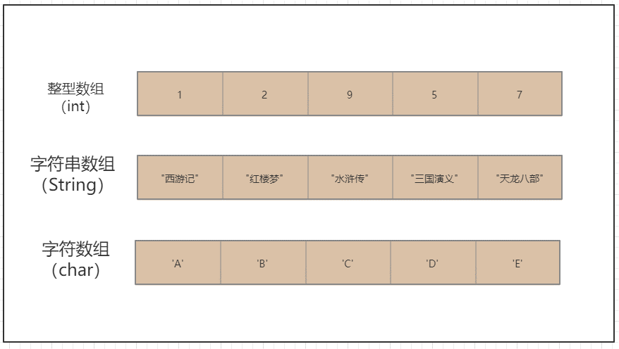
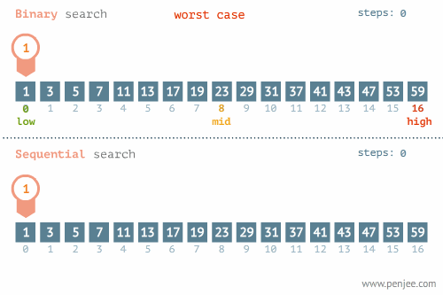

# 方法与数组


## 1. 方法


### 1.1 语句块

语句块是用花括号扩起的任意数量的简单 Java 语句

块确定了局部变量的作用域

块中的程序代码，作为一个整体，是要被一起执行的

块可以被嵌套在另一个块中，但是不能在两个嵌套的块内声明同名的变量

语句块可以使用外部的变量， 而外部不能使用语句块中定义的变量，因为语句块中定义的变量作用域只限于语句块 

```java
int n;
int a;
{
    int k;
    int n;//编译错误，外部变量在块内部可用，所以属于重复声明
}

k = 1;//编译错误，k的生命周期只在代码块中有效。此处属于引用未声明变量
```

------


### 1.2 方法

方法是一组为了实现特定功能的代码块的集合

结构化代码：将代码按照功能进行组织，使代码的结构比较清晰，容易阅读和修改，也就是程序的可维护性强

减少代码重复：一个固定的功能，可能会在程序中多次使用，在使用时只需要调用写好的方法，而不用重复书写对应的功能代码

------

方法必须先创建才可以使用，该过程称为**方法定义**

方法创建后并不是直接可以运行的，需要手动使用后，才执行，该过程成为**方法调用**

------


#### 1.2.1方法定义的四种类型

- 无参无反
- 有参无反
- 无参有反
- 有参有反


##### 1.2.1.1无参无反

###### 语法结构

```java
修饰符1 修饰符2 无返回值 方法名() {
    //方法体
}
```

------

###### 案例

```java
public static void main(String[] args){
    method();
}


public static void method(){
    System.out.println("method方法运行！")
}

//结果
//method方法运行！
```

------


##### 1.2.1.2 有参无反

###### 语法结构

```java
修饰符1 修饰符2 无返回值 方法名(参数){
    //方法体
}
```

------

###### 案例

```java
public static void main(String[] args){
    int a = 5;
    int b = 8;	
    getMax(a,b);//此时传递的a , b称作实参
}

public static void getMax(int x,int y){// x , y称作形参
    int max = a > b ? a : b;
    System.out.println(max);
}

//结果
//8
```

------

##### 1.2.1.3 无参有反

###### 语法结构

```java
修饰符1 修饰符2 返回值类型 方法名(){
    //方法体
}
```

------

###### 案例

```java
public static void main(String[] args){
    int a;
    a = getNumber();
    System.out.println(a);
}

public static int getNumber(){
    return 100;
}

//结果
//100
```

------

##### 1.2.1.4 有参有反

###### 语法结构

```java
修饰符1 修饰符2 返回值类型 方法名(参数){
    //方法体
}
```

------

###### 案例

```java
public static void main(String[] args){
    int a = 10;
    int b = 20;	
    int max;    
    max = getMax(a,b);
    System.out.println(max);
}

public static int getMax(int x,int y){
    int max = a > b ? a : b;
    return max;
}

//结果
//20
```

------

#### 1.2.2 方法的详细说明

**形式参数：**在方法声明时用于接收外界传入的数据

**实参：**调用方法时实际传给方法的数据

**返回值：**方法在执行完毕后返还给调用它的环境的数据

**返回值类型：**事先约定的返回值的数据类型，如无返回值，必须指定为 void

>**注意事项**
>
>1. 实参的数目、数据类型和次序必须和所调用的方法声明的形式参数列表匹配
>2. return 语句终止方法的运行并指定要返回的数据
>3. Java 中进行方法调用中传递参数时，遵循值传递的原则 (传递的都是数据的副本)：
>   - 基本类型传递的是该数据值的 copy 值。
>   - 引用类型传递的是该对象引用的 copy 值，但指向的是同一个对象

------

#### 1.2.3 方法重载

> 方法的重载是指一个类中可以定义多个方法名相同，但参数不同的方法。 
>
> 调用时，会根据不同的参数自动匹配对应的方法

##### 1.2.3.1 构成方法重载的条件

1. 多个方法在同一个类中
2. 多个方法具有相同的方法名
3. 多个方法的参数不相同，类型不同或者数量不同

```java
public void eat(){
    System.out.println("开始吃...")
}
public void eat(String name){
    System.out.println( name + "开始吃..." )
}

eat();//开始吃
eat("旺财");//旺财开始吃
```

------


## 2. 数组

> **为什么要使用数组**
>
> 在程序中储存50个学生学习成绩
>
> 需要声明50个变量？并逐个赋值？

> **存在问题**
>
> 1. 过程繁琐
> 2. 定义变量太多
> 3. 操作变量不方便

### 2.1 数组概述

数组就是存储数据长度固定的容器，存放一些相同元素的集合



------

### 2.2 数组的四个特点

1. 长度是确定的。数组一旦被创建，它的大小就是不可以改变的
2. 其元素的类型必须是相同类型，不允许出现混合类型
3. 数组类型可以是任何数据类型，包括基本类型和引用类型
4. 数组变量属于引用类型，数组也是对象

------

### 2.3 数组声明的两种方式

推荐使用

```java
数据类型[] 数组名;
int[] arr;
double[] arr;
char[] arr;
```

了解

```java
数据类型 数组名[];
int arr[];
double arr[];
char arr[];
```

------

### 2.4 数组使用四部曲

**声明数组**

```java
数据类型[] 数组名;
int[] a;
```

此操作会在栈内存中开辟a空间

------

**分配空间**

```java
数组名 = new 数据类型[长度];
a = new int[5];
```

此操作会在堆内存中开辟空间，并让栈内存中的变量指向堆内存

------

**赋值**

```java
数组名[索引] = 值;
a[0] = 10;
```

此操作会改变堆内存中相应数据

------

**使用数据**

```java
数组名[索引] = 改变值;
a[0] = 10 + 20;

System.out.printlln(a[0]);
```

------

### 2.5 数组的组成部分

**数据类型：**数组的类型可以基本类型也可以是引用类型

**数组名：**数组名就是变量名，要符合变量名的命名规则

**下标索引：**数组的下标从0开始

**数组元素：**每一个空间存储的值

------

### 2.6 初始化

> 数组的初始化方式总共有三种
>
> - 静态初始化
> - 动态初始化
> - 默认初始化

#### 2.6.1 动态初始化

```java
数据类型[] 数组名 = new 数据类型[数字长度];
int[] a1 = new int[2];//在声明数组时，分配空间（长度）
a1[0] = 1;
a1[1] = 2;//给数组中元素赋值
```

#### 2.6.2 静态初始化

```java
//1.不常用方法
数据类型[] 数组名 = new 数据类型[]{元素1,元素2,......};
int[] a = new int[]{1,2,3};

//2.常用方法，静态初始化可以等号后直接接大括号
数据类型[] 数组名 = {元素1,元素2,......};
int[] a = {1,2,3};
```

#### 2.6.3 默认初始化

```java
int a2[] = new int[2];//数组中存储默认值：0,0
boolean[] b = new boolean[2];//数组中存储默认值：false,false
String[] s = new String[2];//数组中存储默认值：null,null
```

-----

### 2.7 常见问题

**常见问题1：**索引越界异常

```java
int[] arr = new int[3];
System.out.println(arr[3]);
//ArrayIndexOutOfBoundsException
```

**原因：**数组长度为3，索引范围为0~2，但我们访问了索引为3的元素，该元素不存在

----

**常见问题2：**空指针异常

```java
int[] arr = new int[3];
arr = null;
System.out.println(arr[0]);
//NullPointerException
```

**原因：**arr = null，意味着该变量不会指向任何堆内存中的内存地址，arr[0]更不会存在

----

### 2.8 遍历

**for循环遍历**

```java
int[] a = new int[4];
for ( int i = 0; i < a.length; i++ ){
    System.out.println(a[i])
}
```

**for-each遍历（增强for）**

```java
int[] a = new int[4];
for ( int i : a ){
    System.out.println(i)
}
```

**注意：**

- for-each遍历中，不能修改数组中元素的值
- for-each仅适用于遍历，不涉及有关索引操作

----

### 2.8 数组的操作

#### 2.8.1 修改

```java
String[] s = {"网易","搜狐","京东","阿里"};
//需求：把网易修改为腾讯
s[0] = "腾讯";
for (String name : s){
    System.out.println(name);
}
```

----

#### 2.8.2 查找

```java
String[] s = {"网易","搜狐","京东","阿里"};
//需求：查询数组中是否存在“京东”如果存在，则输出“存在”，并且输出它所在数组的下标索引，否则输出“不存在”
boolean flag = false;
for ( int i = 0; i < s.length; i++ ){
    if ( s[i].equals("京东") ){
        flag = true;
        System.out.println("存在，索引为：" + i);
        break;
    }       
}

if ( !flag ) System.out.println("不存在");
```

----

#### 2.8.3 拷贝

```java
String[] s = {"网易","搜狐","京东","阿里"};
//需求：把s数组中的数据，拷贝到s2数组
String[] s2 = new String[s.length];
for ( int i = 0; i < s.length; i++ ){
    s2[i] = s[i];    
}
```

----

#### 2.8.4 删除

```java
String[] s = {"网易","搜狐","京东","阿里"};
//需求：删除搜狐
String target = "搜狐";
String[] s2 = new String[s.length-1];
int indexS2 = 0;
for ( int i = 0; i < s.length; i++ ){
    if ( !s[i].equals("搜狐") ){
        s2[indexS2++] = s[i];
    }   
}
```

------

#### 案例1

**需求：**求数组中的最大值和最小值，然后判断这个数组中有几个偶数，再定义一个正好能存放这几个偶数的数组，将上一个数组中的所有偶数复制过来。最后循环输出这些偶数

```java
int[] num = {3,8,1,6,3,7}
int max = num[0];//用于保存最大值
int min = num[0];//用于保存最小值
for ( int i = 0; i < num.length; i++ ){
    if ( num[i] > max ){
        max = num[i];
    }
    if ( num[i] < min ){
        min = num[i];
    }
}
System.out.println( "max:" + max );
System.out.println( "min:" + min );
```

#### 案例2

**需求：**定义一个长度为5的整型数组，循环输入5个整数

```java
int[] num = new int[5];
Scanner sc = new Scanner(System.in);
int even = 0;//存储偶数的个数
for ( i = 0; i < num.length; i++ ){
    System.out.println( "请输入第" + ( i + 1 ) + "个数" );
    num[i] = sc.nextInt();
    if ( num[i] % 2 == 0 ){
        even++;
    }
}
int[] evenArr = new int[even];
int evenArrIndex = 0;//该Index用于控制evenArr数组
for ( i = 0; i < num.length; i++ ){
    if ( num[i] % 2 == 0 ){
        evenArr[index] = num[i];
        index++;
    }
}
```

------

### 2.9 冒泡排序算法

冒泡排序算法重复地走访过要排序的数列，一次比较两个元素，如果他们的顺序错误就 把他们交换过来
这样越大的元素会经由交换慢慢“浮”到数列的顶端


**操作如下：**

1. 比较相邻的元素。如果第一个比第二个大，就交换他们两个
2. 对每一对相邻元素作同样的工作，从开始第一对到结尾的最后一对。在这一点，最后的元素应该会是最大的数
3. 针对所有的元素重复以上的步骤，除了最后一个
4. 持续每次对越来越少的元素重复上面的步骤，直到没有任何一对数字需要比较

**代码实现：**

```java
int[] arr = {8,2,7,3,5,4};
bubbleSort(arr);

public void bubbleSort(int[] arr){
    //外层循环控制比较的轮次
    for ( int i = 0; i < arr.length-1 ; i++ ){
        //内层循环控制比较次数
        for ( int j = 0; j < arr.length - i - 1; j++ ){
            //相邻数字比较、交换
            if ( arr[j] > arr[j+1] ){
                int temp = arr[j];
                arr[j] = arr[j+1];
                arr[j+1] = temp;
            }
        }
    }
}
```

------

### 2.10 二分法查找算法

二分法检索又称折半检索

二分法检索的基本思想是设数组中的元素从小到大有序地存放在数组中

首先将给定值 key 与数组中间位置上元素的关键码(key)比较

如果相等，则检索成功



**代码实现：**

```java
int[] arr = {1,6,3,7,9,5,8};
Arrays.sort(arr);//工具类，实现排序
int target = 6;
binarySearch(arr,target);

public int binarySearch(int[] arr,int target){
    int low = 0;
    int high = arr.length - 1;
    while ( low <= high ){
        int mid = ( low + high ) / 2;
        if ( arr[mid] == target ){
            return mid;
        }
        if ( arr[mid] > target ){
            high = mid - 1;
        }
        if ( arr[mid] < target ){
            low = mid + 1;
        }
    }
    return -1;
}
```

------

### 2.11 二维数组

二维数组可以看做是一张表格，二维数组的每一个元素是一个一维数组

|   7   |   8   |   9   |
| :---: | :---: | :---: |
| **4** | **5** | **6** |
| **1** | **2** | **3** |


#### 2.11.1 二维数组的声明

```java
int[][] a = new int[3][];//声明二维数组a
a[0] = new int[2];//创建第1行的列数为2
a[1] = new int[4];//创建第2行的列数为4
a[2] = new int[3];//创建第3行的列数为3
```

<table>
    <tr align="center">
        <td colspan="6">a[0][1]</td>
        <td colspan="6">a[0][2]</td>
    </tr>
    <tr align="center">
        <td colspan="3">a[1][1]</td>
        <td colspan="3">a[1][2]</td>
        <td colspan="3">a[1][3]</td>
        <td colspan="3">a[1][4]</td>
    </tr>
    <tr align="center">
        <td colspan="4">a[2][1]</td>
        <td colspan="4">a[2][2]</td>
        <td colspan="4">a[2][3]</td>
    </tr>
</table>


#### 2.11.2 二维数组动态初始化

````java
int[][] a = new int[3][];
a[0] = new int[]{2,2};
a[1] = new int[]{2,2,3,4};
a[2] = new int[]{1,2,5};
````

#### 2.11.3 二维数组静态初始化

```java
int[][] a = {{1,2,3},{4,5,6},{7,8,9}};
```

#### 案例

输入3行3列int类型的数字，并打印输出

```java
Scanner sc = new Scanner(System.in);
int[][] arr = new int[3][3];
for ( int i = 0; i < arr.length; i++ ){
    for ( int j = 0; j < arr[i].length; j++ ){
        System.out.println("请输入第" + ( i + 1 ) + "行的第" + ( j + 1 ) + "列");
        sc.nextInt();
    }
}
for ( int[] ints : arr ){
    for (int anInt : ints ){
        System.out.println(anInt + "\t");
    }
    System.out.println();
}
```

------


### 2.12 Arrays工具类的使用

JDK 提供的 java.util.Arrays 类，包含了常用的数组操作，方便我们日常开发

>- Arrays.sort(数组名)：对数组进行升序排序
>- Arrays.toString(数组名)：将一个数组array转换成一个字符串
>- Arrays.fill(数组名,指定元素)：把数组array所有元素都赋值为指定数
>- Arrays.copyOf(数组名, 数组长度)：把数组array复制成新数组，返回类型与复制的数组一致
>- Arrays.equals(数组1,数组2)：比较两个数组是否相等
>- Arrays.binarySearch(数组名,查找的元素)：二分法查找

#### 演示

```java
int[] num = {1,9,2,8,3,6,4};
Arrays.sort(num);//{1,2,3,4,6,8,9}

System.out.println(Arrays.toString(num));//[1,2,3,4,6,8,9]

//Arrays.fill(num,100);//[100,100,100,100,100,100,100]
Arrays.fill(num,0,3,100);//[100,100,100,4,6,8,9]

int[] newNum = Arrays.copyOf(num,num.length);
System.out.println(Arrays.toString(newNum));//[100,100,100,4,6,8,9]
```


