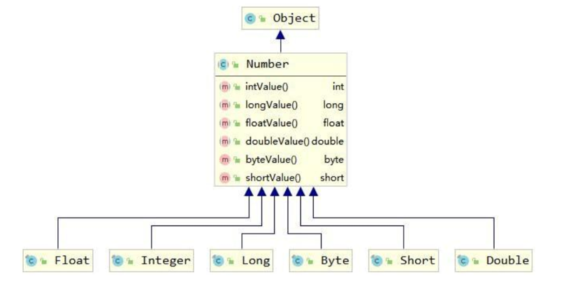

# 常用API

1. 什么是API：API (Application Programming Interface) ：应用程序编程接口

2. java中的API：指的就是 JDK 中提供的各种功能的 Java类，这些类将底层的实现封装了起来，我们不需要关心这些类是如何实现的，只需要学习这些类如何使用即可，我们可以通过帮助文档来学习这些API如何使用

   

   **Java API 文档**

   

## 1 包装类

### 1.1 基本数据类型对应的包装类

| 基本数据类型 |  包装类   |
| :----------: | :-------: |
|     byte     |   Byte    |
|   boolean    |  Boolean  |
|    short     |   Short   |
|     char     | Character |
|     int      |  Integer  |
|     long     |   Long    |
|    float     |   Float   |
|    double    |  Double   |

包装类均位于 java.long 包

在这八个类中，除了 Character 和 Boolean 以外其他的都是数字型，数字型都java.lang.Number 的子类

------

### 1.2 Number类



> Number 类提供了抽象方法：
>
> intValue()、longValue()、floatValue()、doubleValue()，意味着所有的“数 字型”包装类都可以互相转型

 

**示例1：创建包装类**

```java
Integer i = new Interger(10);
Integer j = new Interger(20);
```

 

**示例2：类型相互转换**

```java
int i = 10;
Integer j = Interger.valueOf(i);
Integer x = Interger.valueOf(100);
int y = intValue(x);

String s = "123";
Integer snum = Integer.parseInt(s);

Integer z = Interger.valueOf(100);
String s2 = z.toString;
```

------

### 1.3 自动装箱/拆箱

自动装箱和拆箱就是将基本数据类型和包装类之间进行自动的互相转换。

JDK1.5 后，Java 引入了自动装箱和自动拆箱

 ```java
 //自动装箱
 Integer i = 5;//Integer i = Interger.valueOf(5);
 
 //自动拆箱
 int j = i;//int j = intValue(i);
 
 ```

------

## 2 字符串相关类

1. String表示字符串,所谓字符串,就是一连串的字符（例如“abc”）
2. String 类在 java.lang 包下，所以使用的时候不需要导包！
3. String是不可变类，一旦String对象被创建，包含在对象中的字符序列(内容)是不可变的，直到对象被销毁

**一定要学会使用API**

