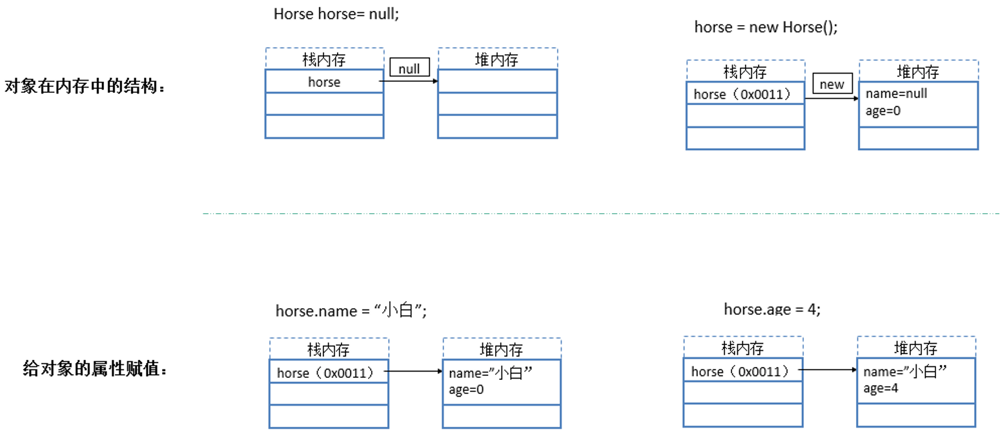
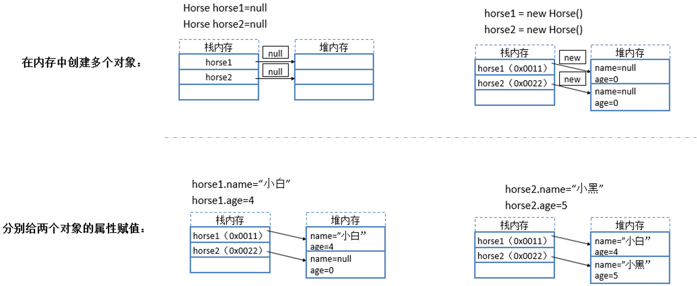
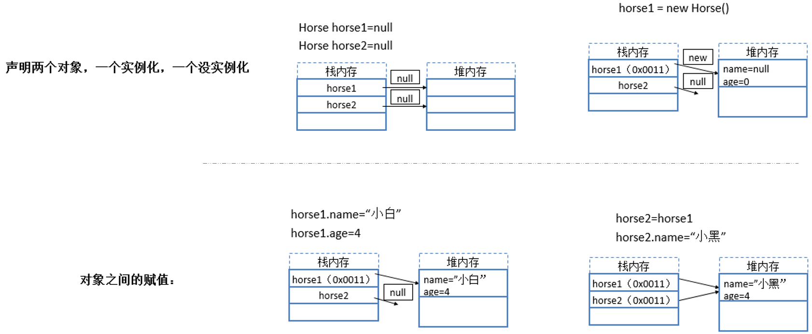
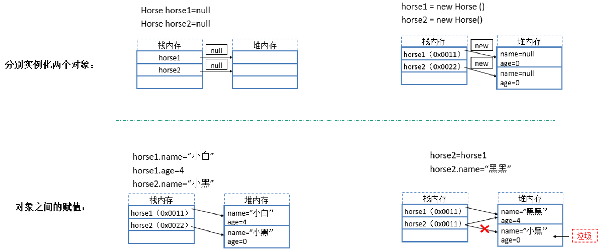

# 面向对象

## 1 面向对象基本概念


### `1.1 概念`

> 面向对象是一种编程思维，也是一种思考问题的方式


> `OOA：`面向对象分析  Object-Oriented Analysi
>
> `OOD：`面向对象设计  Object-Oriented Design
>
> `OOP：`面向对象编程  Object-Oriented Programming


------

### `1.2 面向过程与面向对象的区别`

> 面向`过程`
>
> 强调的是一种`行为`，一种`过程`，先干啥，再干啥（执行者）

> 面向`对象`
>
> 强调的是具备功能的`对象`（管理者）

>**`区别`**
>
>1. 都是解决问题的思维方式
>2. 面向过程是一种“`执行者`思维”，解决简单问题可以使用面向过程。 
>3.  面向对象是一种“`设计者`思维”，解决复杂、需要协作的问题可以使面向对象
>4. 面向对象`离不开`面向`过程  `
>5. 宏观上：通过面向对象进行`整体设计  `
>6. 微观上：`执行`和`处理`数据，仍然是面向`过程`。


### `1.3 面向对象的思维`

> - 先整体、再局部
> - 先抽象、再具体
> - 能做什么、再做什么


### `1.4 面向对象的三个特征`

> - **封装**
> - **继承**
> - **多态**


## 2 类与对象

>**类**
>
>类是一种`分类`，一个`类别`，一个`模板`，它描述一类对象的`行为`和`状态`，是一组具有相同特性（属性）与行为（方法）的事物`集合`

> **对象**
>
> 对象是一个你能够看得见摸得着`真实存在`的具体`实体`,`万事万物皆对象`


### `2.1 举例`


------

### `2.2 类的定义格式`

**`语法结构`**

```java
修饰符 class 类名{
    属性;
    方法(){};
}
```

```java
public class Person{
    private String name;
    public void show(){
        
    }
}
```


------

### `2.3 对象的定义格式`

#### 2.3.1 声明对象

```java
类名    对象名;
Person p1;
```

#### 2.3.2 开辟空间

```  java
对象名  =  new 类名();
p1 = new Person();
```

#### 2.3.3 属性赋值

```java
对象名.属性名 = 值;
p1.name = "张三";
```

> 访问类中的`属性`：对象.属性;
>
> 访问类中的`方法`：对象.方法（）;

> 声明对象：在栈空间中放入对象
>
> 开辟空间：在堆空间中开辟内存空间，并使对象指向该堆空间地址


### `2.4 对象定义的两种格式`

> **声明对象：**
>
> Person p = null;
>
> 表示声明了一个对象,但是此对象无法使用，p没有具体的内存指向

> **实例化对象：**
>
> Person p = new Person();
>
> 表示实例化了对象，可以使用
>
> new 关键字表示创建一个对象
>  new 关键字表示实例化对象
>  new 关键字表示申请内存空间


### `2.5 对象与内存分析`


> 分析一




> 分析二



> 分析三



> 分析四




> 1. new关键字表示向`内存申请空间`，也表示`实例化`一个对象，`创建`一个对象
> 2. 在`确定不使用`对象时，要尽早`释放`对象：引用=null
> 3. 相同的类型才可以赋值
> 4. `不同的引用`，指向`同一个`对象，任何一个引用`改变`对象的值，其它引用`都会`反映出来
> 5. 当一个堆中的对象`没有被任何引用`时，该对象会被JVM的GC程序认为是垃圾对象，从而被回收
> 6. 先有类，然后再有对象


## 3 封装

> `封装`是面向对象`三大特征`之一
>
> 作用是"`信息隐藏`", 把`不需要`让外界知道的信息`隐藏`起来,尽可能隐藏对象功能`实现细节`

> 封装的`优势`
>
> - 提高代码的`安全`性
> - 提高代码的可`维护`性
> - 提高代码的`复用`性
> - 提高代码的可`扩展`性


### `3.1 封装要点`

> 1. **属性私有化**
>
> 2. **提供公有的get和set方法**
>
>    get变量名()方法：用于获取成员变量的值
>
>    set变量名(参数)方法：用于设置成员变量的值


#### 3.1.1 未进行封装的代码演示

```java
public class Person{
    public String name;
}

public class Test{
    public static void main(String[] args){
        Person p = new Person();
        p.name = "张三";
        System.out.println(a.name);//张三
    }
}
```


#### 3.1.2 使用封装后的代码演示

```java
public class Person{
    private String name;
    
    public String getName() {
        return name;
    }

    public void setName(String name) {
        this.name = name;
    }
    
}

public class Test{
    public static void main(String[] args){
        Person p = new Person();
        p.name = "张三";//错误，不能直接访问
        p.setName("张三");
        System.out.println(p.getName());//张三
    }
}
```


### `3.2 成员变量和局部变量的区别`

> **在类中的位置不同**
>
> `成员变量：`
>
> 在类中定义
>
> `局部变量：`
>
> 在方法中定义或者方法的参数

> **在内存中的位置不同**
>
> `成员变量：`
>
> 在堆内存(成员变量属于对象，对象进堆内存)
>
> `局部变量：`
>
> 在栈内存(局部变量属于方法，方法进栈内存)

> **生命周期不同**
>
> `成员变量：`
>
> 随着对象的创建而存在，随着对象的销毁而消失
>
> `局部变量：`
>
> 随着方法的调用而存在，随着方法的调用完毕而消失

> **初始化值不同**
>
> `成员变量：`
>
> 有默认初始化值，引用类型默认为null
>
> `局部变量：`
>
> 没有默认初始化值，必须定义，赋值，然后才能使用


## 4 构造方法

> 构造方法是一种特殊的方法，方法名与类名`同名`

`语法结构`

```java
public class 类名{
    修饰符 类名(){
        
    }
}


public class Person{
    public Person(){
        
    }
}
```

> **构造方法作用：**
>
> 1. 创建对象：Person stu = new Person();
> 2. 初始化数据：完成对象数据的初始化操作


### `4.1 构造方法分类`

`无参构造方法`

```java
public  Person(){
}
```

`带参构造方法`

```java
public Person(String name,int age){
	this.name = name;
	this.age = age;
}
```


### `4.2 注意事项`

> 1. 构造方法名称与`类名相同`，`没有返回值`声明（`包括 void`）
> 2.  构造方法用于`初始化`数据（属性）
> 3.  每一个类中都会有一个`默认`的`无参`的构造方法
> 4.  如果类中`有`显示的`构造方法`，那么`默认`构造方法将`无效`
> 5.  如果有显示的构造方法，还想保留默认构造方法，需要显示的`写出来`
> 6.  构造方法可以`有多个`，但`参数不一样`，称为构造方法的`重载`
> 7.  在构造方法中调用另一个构造方法，使用this(...)，该句代码必须在第一句。
> 8.  构造方法之间的调用，必须要有出口。
> 9.  给对象初始化数据可以使用构造方法或setter方法，通常情况下，两者都会保留。
> 10.  一个好的编程习惯是要保留默认的构造方法。（为了方便一些框架代码使用反射来创建对象）
> 11.  private Person(){}，构造方法私有化，当我们的需求是为了 保正该类只有一个对象时（单例模式就是私有化构造器）。

### `4.3 优先级别`

> 静态块、语句块、构造块的优先级别

```java
public class Dog{
    
    public Dog(){
        System.out.println("构造方法");
    }
    
    {
        System.out.println("代码块");
    }
    
    static{
        System.out.println("静态代码块");
    }
}
```

> 1. 静态代码块
> 2. 代码块
> 3. 构造方法


### `4.4 举例说明(不太恰当，仅供理解)`

> 数据就像是菜
>
> 封装就像是去餐厅，不是在自己家，触碰不到菜
>
> 你去餐厅是不能自己去后厨端菜的
>
> get就像是服务员上菜，他帮你去后厨拿'数据'  // 你桌上的菜=餐厅.服务员上菜( ) ;
>
> set就像是服务员点菜，他帮你改变后厨的'数据'  // 餐厅.服务员点菜( ) ;
>
> 类中的方法就像是餐厅提供的一些服务，比如说show方法
>
> 就像是回转寿司，餐厅是可以直接处理你的菜
>
> 他选择把菜放到履带上  // 餐厅.服务员把菜放到转盘上( ) ;
>
> 也可以达成让你看到你点的菜的目的
>
> 构造方法就像是我没看菜单，但我知道我想吃什么
>
> 比如每次去肯德基只吃全家桶
>
> 就可以//  new 肯德基（点菜全家桶）;


## 5 this static关键字

### `5.1 this关键字`

> 表示为`当前对象`的引用，换言之，谁调用了方法，谁就是当前对象引用

> **应用场景**
>
> - 调用类中的`属性`：this.属性名称，指的是访问类中的成员变量，用来区分成员变量和局部变量（重名问题）
> - 调用类中的`方法`：this.方法名称，用来访问本类的成员方法
> - 调用类构造`方法`：this();访问本类的构造方法，()中可以有参数的 如果有参数 就是调用指定的有参构造

> **注意事项**
>
> 1. this() `不能`使用在`普通方法`中，`只能`写在`构造`方法中
> 2. 必须是构造方法中的`第一条`语句


### `5.2 static关键字`

> 使用static修饰属性，属性叫类变量或者`静态变量`
>
> 使用static修饰方法，方法叫类方法或者`静态方法`


```java
public class Test01 {    
    public void test01(){
        TestStatic.show();
        System.out.println(TestStatic.PI_);
    }
}

class TestStatic {
    
    public static final double PI_=3.14;
    
    public static void show() {
        System.out.println("π的值为：");
    }
    
}
```


> `访问方式`
>
> 1. 类.字段、类.方法()
> 2. 对象名.字段、对象名.方法名()

> `特点`
>
> 1. 随着类的加载而加载
> 2. 优先于对象存在
> 3. 被所有对象所共享
> 4. 可以直接被类名调用

> `注意事项`
>
> 1. 静态方法只能访问静态成员
> 2. 非静态方法即可以访问静态成员也可以访问非静态成员
> 3. 静态方法中不可以使用this，super关键字

> `小结`
>
> 1. static 修饰的字段和方法，既可以通过类调用，也可以使用实例调用；
> 2. 没static 修饰的字段和方法，只能使用实例来调用
> 3. static关键字不能与this，super同时连用！


## 6 值传递与引用传递

### `6.1 基本数据类型的按值传递`

> 在java中只有按值传递，并没有所谓的按引用传递

```java
public static void main(String[] args) {
        int x = 10;
        int y = 20;
        swap(x, y);
        System.out.println("main中的x = " + x);
        System.out.println("main中的y = " + y);
}

public static void swap(int x, int y) {
	int temp = x;
	x = y;
	y = temp;
	System.out.println("方法中的x = " + x);
	System.out.println("方法中的y = " + y);
}

//方法中的x = 20
//方法中的y = 10

//main中的x = 10
//main中的y = 20
```


> main函数中的x，y和swap函数中的x，y分别存放在`不同的区域`
>
> 在main中调用swap函数的时候，会将main中的x，y的值`赋给`swap中的x，y
>
> 当swap函数中对x，y交换时`只是`对swap帧中的x，y做`交换`
>
> `并不会改变`main中的x，y
>
> 所以当函数返回时main中的x，y并不会改变


### `6.2 引用数据类型的按值传递`

> 引用类型的按值传递，传递的是对象的地址

```java
public static void main(String[] args) {
    int[] a = {10, 20};
    System.out.println("原始 = a[0] :" + a[0] + "\ta[1] : " + a[1]);
    swap(a);
    System.out.println("交换后main中 = a[0] :" + a[0] + "\ta[1] : " + a[1]);
}

public static void swap(int[] a) {
    int temp = a[0];
    a[0] = a[1];
    a[1] = temp;
    System.out.println("交换后方法中 = a[0] :" + a[0] + "\ta[1] : " + a[1]);
}

//原始 =         a[0] :10	  a[1] : 20
//交换后方法中 = a[0] :20	   a[1] : 10
//交换后main中 = a[0] :20	a[1] : 10
```


> 在swap中仅仅是`得到`了数组的`地址`，并`没有`对数组的元素进行`复制`
>
> 在swap中对数组的操作是直接对main函数中数组的操作
>
> 因此swap函数返回后main函数中的a[0] ,a[1]的值发生交换


## 7 包

### `7.1 包的作用`

> - 解决类的`同名`问题
> - 组织源代码`便于管理`
> - `护`类、属性和方法的访问


### `7.2 包的创建`


```java
package com.augus.demo;
```


### `7.3 包规范`

> - 包的关键字`package`
>
> - 包的名字有`层次`关系，各层之间以点分隔
>
> - 包名全部使用`小写`字母
>
> - 域名`倒着`写，再加上模块名
>
>   com.sina.games
>
>   com.sohu.news


### `7.4 导入包`

> 如果我们要使用其他包的类，就需要使用` import `导入

> - 通配符`*`导入该包下`所有`的类。会降低编译速度，但不会降低运行速度
> - Java 会`默认`导入 `java.lang `包下所有的类，因此这些类我们可以直接使用
> - 如果导入两个`同名`的类，只能用包名+类名来显示调用相关类：java.util.Date date = new java.util.Date();


