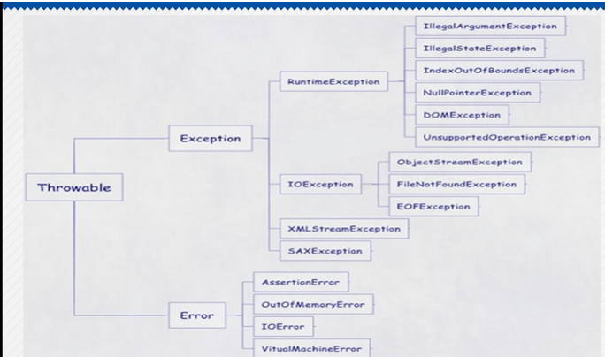
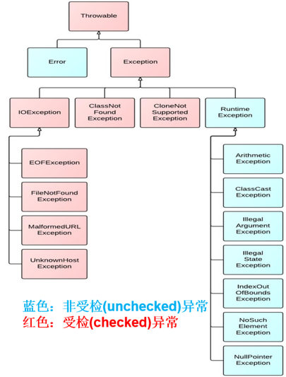
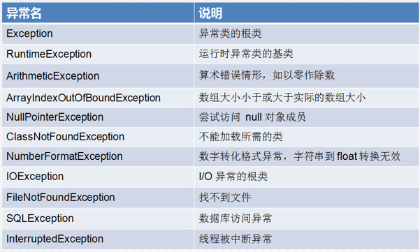

# 异常处理

## 1 异常概述

> 异常指的是程序在执行`过程中`，出现的`非正常`的情况，如果`不处理`最终会导致`JVM`的`非正常停止`


### `1.1 程序中的异常`

```java
public static void main(String[] args) {
	int num1 = 10;
	int num2 = 0;
	int sum = num1/num2; 
	System.out.println("程序结束！");
}
//java.lang.ArithmeticException: / by zero 
```

```java
public static void main(String[] args) {	
	char[] str = {'我','爱','你'};
	System.out.println(str[3]);
	System.out.println("程序结束!!!");
}
//java.lang.ArrayIndexOutOfBoundsException: 3
```


## 2 异常体系





### `2.1 Error 和 Exception的区别`

> **Error（天灾）**
>
> 通常指JVM出现`重大问题`如：运行的类不存在或者内存溢出等。
>
> `不需要`编写针对代码对其处理，程序无法处理
>
> **Exception(人祸)**
>
> 在编程时出现的问题，程序员可以通过代码的方式纠正，使程序`继续运行`是必须要处理的


## 3 异常分类



> 1. `编译`时异常：在编译时期,就会`检查`,如果没有处理异常,则`编译失败`。(如文件找不到异常)
> 2. `运行`时异常：在编译时期,运行异常`不会`被编译器检测到(不报错)。如：数组索引越界异常，类型转换异常。


```java
public static void main(String[] args) {	
	Class.forName("");
}
//编译时异常
```


```java
public static void main(String[] args) {
	int[] num = new int[3];
	System.out.println(num[100]);
}
//运行时异常
```


**`常见异常（重要）`**




## 4 异常处理

> 1. 捕获异常
> 2. 声明异常


### `4.1 捕获异常`

> 使用`try`、`catch`、`finally`处理异常

```java
try{
	//可能出异常的代码
} catch(异常类  对象){
	//处理该异常类型的语句
}
[finally] {
	//一定会执行的代码
	//catch块使用System.exit(1);除外
}

```

> 1. 程序从`try`里面的代码`开始`执行
> 2. `出现`异常，就会跳转到对应的`catch里面`去执行
> 3. 不管是否有异常，`最终都`会执行finally代码


#### `4.1.1 单个异常捕获`

```java
try {
	int num1 = 10;
	int result = num1 / 0;
} catch (ArithmeticException e) {
	e.printStackTrace();
} finally {
	System.out.println("finally执行了");
}
System.out.println("程序结束！");

/**
java.lang.ArithmeticException: / by zero
finally执行了
程序结束！
*/
```


#### `4.1.2 多个异常捕获`

```java
        try {
            int[] nums = {1, 2, 3, 4, 5, 6};
            System.out.println(nums[10]);
            int num1 = 10;
            int result = num1/0;
        } catch (ArithmeticException e) {
            e.printStackTrace();
        }catch (IndexOutOfBoundsException e){
            e.printStackTrace();
        }catch (Exception e){
            e.printStackTrace();
        }finally {
            System.out.println("finally执行了");
        }
        System.out.println("程序结束");
```


#### `4.1.3 小结`

> 1. 不管try块程序是否异常，也不管哪个catch执行，finally块`总会执行`
> 2. try块必须和catch块或和finally同在，不能单独存在，二者必须出现一个
> 3. 在java处理多异常时捕获`小范围`的异常`必须`放在`大范围`异常`之前`


### `4.2 声明异常`

> - Throws关键字是跟在`方法的括号后面`的
>
> - 编译时异常`必须要`进行处理，两种处理方案：
>
>   try...catch …或者 throws，
>
>   如果采用 throws 这种方案，将来`谁调用谁处理`
>
> - 运行时异常可以不处理，出现问题后，需要我们回来修改代码
>
> - 如果一个方法调用另一个使用throws声明抛出的方法
>
>   自己要么try...catch , 要么也throws;


#### `4.2.1 声明异常案例`

```java
    public static void main(String[] args) {
        m3();
    }
    public static void m1() throws IOException {
        throw new IOException();
    }
    public static void m2() throws IOException {
        m1();
    }
    public static void m3() {
        try {
            m2();
        } catch (IOException e) {
            e.printStackTrace();
        }
    }
```


#### `4.2.2 throws和throw的区别`

>`throws`
>
>* 用在`方法声明后面`，跟的是异常`类名`
>* 表示抛出异常，由该方法的`调用者`来处理
>* 表示会出现异常的一种可能性，`并不一定`会发生这些异常

> `throw`
>
> * 用在`方法体内`，跟的是异常`对象名`
> * 表示抛出异常，由方法体内的语句处理
> * 执行throw`一定`抛出了某种异常


## 5 自定义异常

> 当开发时，项目中出现了java中没有定义过的异常时，这时就需要我们按照java异常建立思想，将项目的中的特有问题也进行对象的封装。这个异常，称为自定义异常

> 1. 定义一个子类`继承Exception或其子类`
> 2. 通过throw或者throws进行操作


### `案例`

> **需求**
>
> 定义Teacher类，在类中定义checkScore(int score)，通过自定义异常ScoreException类完成“分数”异常的抛出

```java
public class MyScoreException extends RuntimeException{
    public MyScoreException(String message) {
        super(message);
    }
}

public class Teacher {
    public void checkScore(int score){
        if (score>100 || score<0){
            throw new MyScoreException("成绩不合法！");
        }else {
            System.out.println("成绩可用！");
        }
    }
}
```


### `5.1 final,finally,finalize区别`

> `final`
>
> 最终的意思。它可以用于修饰`类`，成员`变量`，成员`方法`。
>
> 它修饰的类不能被继承，它修饰的变量时`常量`，它修饰的方法不能被重写

> `finally`
>
> 是`异常处理`里面的关键字。
>
> 它其中的代码`永远`被执行。特殊情况：在执行它之前jvm退出。System.exit(0);

> `finalize`
>
> 是Object类中的一个方法。
>
> 它是于`垃圾回收器`调用的方式。


