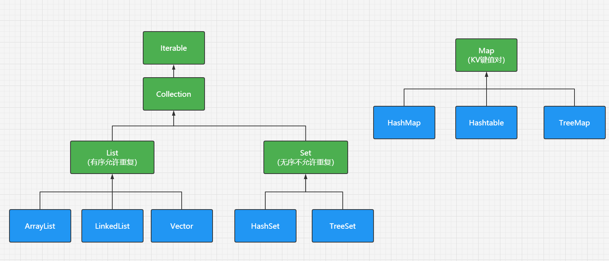

# 集合

## 1. 综述

> 存储对象的容器被称作集合
>
> 集合中只能存放Object，不能是基本类型

> 集合框架体系中，最顶层的都是接口
>
> 方便后期使用（多态）

> 集合的分类




## 2. List

### 2.1 List接口常用方法

|       Boolean add(Object obj)        |              增加一个元素到末尾              |
| :----------------------------------: | :------------------------------------------: |
|              int size()              |                 获取元素个数                 |
|        Object get(int index)         |            获取指定下标的元素对象            |
| Object set(int index, Object newObj) |        替换指定下标的元素对象为newObj        |
|       Object remove(int index)       |              删除指定下标的元素              |
|      Object remove(Object obj)       |     删除指定元素（根据地址传递过来删除）     |
|             void clear()             |                 清除所有元素                 |
|     boolean addAll(Collection c)     | 添加另外一个集合中的元素，到当前这个集合中来 |
|      boolean contains(Object o)      |       判断集合中是否包含某个对象的地址       |

> 集合中判断两个对象是否相等
>
> 调用的是该类的equals()方法
>
> 如果需要按照自己的意愿来表示是否相等
>
> （比如学生，我认为姓名和班级一样，就认为是同一个。或者学号一样，就认为是同一个）
>
> 请自己重写equals()方法

> List的底层就是一个数组，但他是动态扩容的
>
> 看一看源码

> 思考：数组如何转成集合？

> 拓展：为什么生成equals()方法时会默认同时生成hashCode()方法

> ArrayList：其实就是一个动态扩容的数组
>
> LinkedList：是一种链表数据结构
>
> Vector：也是一个动态扩容数组，只不过它是线程安全的，意味着效率低
>
> （画个图展示数组和链表的特点）

### 2.2 遍历集合

#### 2.2.1 for循环

> 仅适用于List接口，因为只有List接口的元素有下标

#### 2.2.2 for-each循环

> 底层实现就是使用了迭代器

#### 2.2.3 迭代器

> 迭代器是什么？
>
> 老师说法：它相当于就是一根光标，从集合的第“-1”下标开始
>
> 我的想法（意思一样方便理解）：就像抓娃娃机的爪子，抓一个扔出来，再去抓一个，不停迭代

> 常用方法：
>
> T next()：获取下一个元素
>
> boolean hasNext()：	判断是否存在下一个元素


```java
List<Integer> list = new ArrayList();
list.add(111);
list.add(222);
list.add(333);
Iterator<Integer> it = list.iterator();

while (it.hasNext()) {
    System.out.println(it.next());
}
//如果我遍历完成后再次遍历会怎么样？
while (it.hasNext()) {
    System.out.println(it.next());
}

//那我们要如何重置it，让它指回第一个值呢
it = list.iterator();
while (it.hasNext()) {
    System.out.println(it.next());
}
```

> 思考：你能否写一个HashSet类？能否写一个LinkedList？


### 2.3 比较器

> 比较器的作用是用于排序

> **Comparable内部比较器:**
>
> ​	只能实现一种比较方式
>
> ​	在元素实体内中去实现
>
> **Comparator外部比较器:**
>
> ​	排序规则定义在元素外部时，调用工具类Collections.sort()方法来进行排序
>
> ​	它在外部新建一个新的比较器类去实现

> **Collections工具类：**
>
> 是集合的工具类，提供了很多静态方法，例如：
>
> sort()，排序
> reverse()，反转
>
> 
>
> Collection是单列集合的接口
> Collections是集合的工具类
>
> 
>
> 带Tree打头的集合自带有排序功能，
> 其他的集合自带是没有排序功能的，但是！！！可以使用Collections.sort()来排序


```java
//外部比较器，匿名内部类实现
List<Person> list = new ArrayList<>();
list.add(new Person("张三",22));
list.add(new Person("安东尼",33));
list.sort(new Comparator<Person>() {
    @Override
    public int compare(Person o1, Person o2) {
        return o1.getAge()-o2.getAge();
    }
});
for (Person person : list) {
    System.out.println(person);
}

System.out.println("=============================");

//内部比较器，Person类实现了Comparable接口
TreeSet<Person> set = new TreeSet<>();
set.add(new Person("张三",22));
set.add(new Person("安东尼",33));
for (Person p : set) {
    System.out.println(p);
}


public class Person implements Comparable<Person>{
    private String name;
    private Integer age;

    @Override
    public int compareTo(Person o) {
        return this.name.compareTo(o.getName());
    }
}
```


## 3. Set

> Set接口中的元素无下标
>
> Set接口中的元素无序
>
> Set接口中的元素不允许重复（引用地址）
>
> Set接口判断元素是否重复的方法是equals

### 3.1 TreeSet类

>自带排序功能，要求元素对象必须实现Comparable接口

> TreeSet集合中的元素类型只有实现了Comparable接口才允许被加入集合<如果不实现就直接抛出异常>，
> 因为TreeSet集合会自动调用元素对象的compareTo()方法进行比较，最后才能得出排序

> TreeSet集合判断是否是同一个元素，取决于Comparable接口中的compareTo()方法

## 4. Map

> Map集合没有下标，且不允许key重复

> Map（键key，值value），将键映射到值对象（通过键找值），键值对集合
>
> 底层数据结构：散列表

> 1. 在通过key获取值时，如果key不存在则获取到的是null
> 2. key必须是唯一的，允许key为null
>    意味着，如果多次put同一个key，第一次是添加，后面的是修改

### 常用方法

| V put(K key, V value)               | 添加"键值对"元素到map集合 |
| ----------------------------------- | ------------------------- |
| V get(Object key)                   | 通过键去获得对应它的值    |
| Set<K> keySet()                     | 获取所有的key的集合       |
| Collection<V> values()              | 获取所有value的集合       |
| V remove(Object key)                | 通过key去移除某个键值对   |
| int size()                          | 返回键-值对的个数         |
| boolean containsKey(Object key)     | 判断是否包含某个key       |
| boolean containsValue(Object value) | 判断是否包含某个value     |


> TreeMap类能够对key进行排序
>
> 意味着TreeMap的key的类型必须实现Comparable接口

> HashMap和Hashtable比较
>
> 底层结构一样（hash表/散列表）、功能也相同（都不能排序），它们都实现了Map接口
>
> **区别**
>
> 1. HashMap继承自AbstractMap，而Hashtable继承自Dictionary
> 2. Hashtable线程安全，HashMap线程不安全（Hashtable效率低，HashMap效率高）
> 3. Hashtable不允许给key和value赋值为null，HashMap则可以


## 5. 泛型

> 泛型就是数据类型参数化，强制规定了集合中的元素类型

> 泛型的作用
>
> - 类型安全（在获取元素时，数据类型就已经确定了，就不需要强制转换了）
> - 消除了强制转换
> - 扩充了原有java数据类型体系

>  java中泛型的标记符有如下几种：
>
> T	-》	Type（java类）
>
> E	-》	Element（一般仅限于在Collection集合中使用，代表元素）
>
> K	-》	Key（一般仅限于Map集合，键）
>
> V	-》	Value（一般仅限于Map集合，值）
>
> N	-》	Number（数值类型）

### 5.1 泛型的语法

```java
//泛型方法
修饰符 <定义泛型标记> 返回值类型  方法名(参数类型  参数名，泛型标记  参数名){
		方法体...
}

public <T> t test01(){
    
}

//泛型类
泛型类的语法：
修饰符  class 类名<定义泛型标记>{

} 

public class Test<T>{
    
}
```


