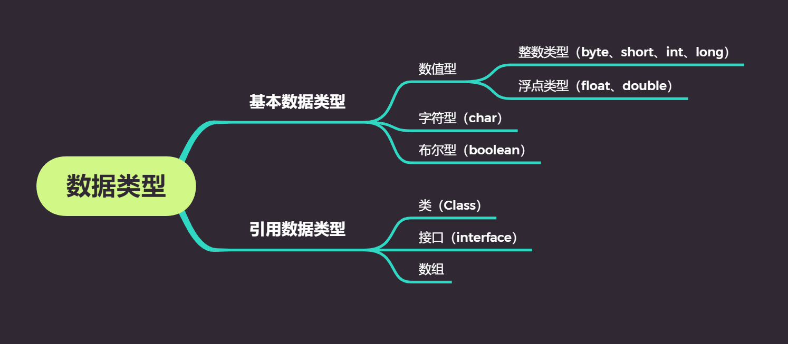

# 变量、数据类型和运算符


## 1注释、标识符、关键字

### `1.1 标识符`

> 标识符是用来给`变量`、`类`、`方法`以及`包`进行命名的
>
> 如Welcome、main、System、age、name、gender等
>
> 标识符需要遵守一定的`规则`
>

#### `1.1.1标识符命名规则`

> 1. 标识符必须以`字母`、`下划线（_）`、`美元符号（$）` 开头
> 2. 标识符其他部分可以是字母、下划线、美元符号和数字的任意组合
> 3. Java标识符`大小写敏感`，且长度无限制
> 4. 标识符`不可以`是`Java关键字`

#### `1.1.2标识符的使用规范`

##### 1.1.2.1类名

> 每个单词的`首字母大写`，如Man，Goodman
>

##### 1.1.2.2方法和变量的标识符

> `第一个单词小写，从第二个单词开始首字母大写`，我们称之为“驼峰原则”。如eat(),eatFood()


#### `合法的标识符`

```java
int a = 3;
int _123 = 3;
int $12aa = 3;
int 变量1 = 55; //不建议使用中文名称的标识符
```


#### `不合法的标识符`

```java
int 1a = 3;//不能以数字开头
int a# = 3;//不能包含#这样的特殊字符
int int = 3;//不能使用关键字
```


### `1.2关键字`

> `Java关键字`是Java预言保留供内部使用的，如Class用于定义类
>
> 关键字也可以称为`保留字`，他们的意思是一样的，我们`不能使用`关键字作为变量名或方法名
>

| abstract       | assert      | boolean       | break         | byte          | case             |
| -------------- | ----------- | ------------- | ------------- | ------------- | ---------------- |
| **catch**      | **char**    | **class**     | **const**     | **continue**  | **default**      |
| **do**         | **double**  | **else**      | **extends**   | **final**     | **finally**      |
| **float**      | **for**     | **goto**      | **if**        | **implement** | **import**       |
| **instanceof** | **int**     | **interface** | **long**      | **native**    | **new**          |
| **null**       | **package** | **private**   | **protected** | **public**    | **return**       |
| **short**      | **static**  | **strictfp**  | **super**     | **switch**    | **synchronized** |
| **this**       | **throw**   | **throws**    | **transient** | **try**       | **void**         |
| volatile       | while       |               |               |               |                  |


## 2变量


### `2.1变量的概念`

> 1. 占据着`内存`中的某一个`存储区域`
> 2. 该区域有自己的`名称（变量名）`和`类型（数据类型）`
> 3. 该区域的数据`可以`在`同一类型`范围内不断`变化`
>

**例**

> 房间   				-------》 		变量
>
> 房间名			   -------》		变量名
>
> 房间类型		   -------》		变量类型
>
> 入住的客人	    -------》		变量值
>

### `2.2变量的声明`

#### 2.2.1变量的语法

> 数据类型	变量名	=	初始化值；
>


**声明变量**

```java
double money;
long number;
int age;
```

> 声明变量`等号与等号右侧初始化值`可以省略，直接加分号结束
>


**注意事项**

> 每个变量都有类型，类型可以是`基本类型`，也可以是`引用类型`
>
> 变量名`必须是`合法的标识符
>
> 变量声明是一条完整的语句，因此每一个声明都必须以分号结束
>


**在一行中声明多个变量**

```java
int i,j;
```

> 两个变量的数据类型都是int，`不提倡`这种写法
>


## 3常量


> 常量通常指的是一个`固定`的值
>
> 例如：1、2、3、"a"、"b"、true、false、"Hello World"等
>
> 在Java语言中，主要是利用`final`来定义一个常量
>
> 常量一旦被初始化后`不能再改变`其值
>


### `3.1声明格式`

> final		type			varName	=	value；
>
> 关键字	数据类型		变量名		  变量值
>


### `3.2常量的使用`

```java
final double PI = 3.14;
PI = 3.15;//编译错误，不能再被赋值！
```


## 4基本数据类型


### `4.1数据类型`

> - Java是一种强类型语言，每个变量都`必须声明`其数据类型
>
> - Java的数据类型可分为两大类：`基本数据类型`和`引用数据类型`
>




### `4.2整形`

> 整形用于表示`没有小数`部分的数值，它`允许是负数`
>

#### 4.2.1整形取值范围与空间占用

| 类型  | 占用存储空间 |                           表数范围                           |
| :---: | :----------: | :----------------------------------------------------------: |
| byte  |    1字节     |       -2<sup>7</sup> ~ 2<sup>7</sup> - 1（-128 ~ 127）       |
| short |    2字节     |    -2<sup>15</sup> ~ 2<sup>15</sup> -1 （-32768 ~ 32767）    |
|  int  |    4字节     | -2<sup>31</sup> ~ 2<sup>31</sup> -1 （-2147483648 ~ 2147483647）约21亿 |
| long  |    8字节     |             -2<sup>63</sup> ~ 2<sup>63</sup> -1              |

 

> Java语言的`整型常数默认`为`int`型，声明`long型`常量可以后`加“l”或“L”（推荐大写）`
>


### `4.3浮点型`

> `带小数`的数据在Java中称为`浮点型`。浮点型可分为float和double类型

#### 4.3.1浮点形取值范围与空间占用

|  类型  | 占用存储空间 |        表数范围        |
| :----: | :----------: | :--------------------: |
| float  |    4字节     |  -3.403E38 ~ 3.403E38  |
| double |    8字节     | -1.798E308 ~ 1.798E308 |

  

#### 4.3.2声明使用

```java
float f = 3.14F;//float类型赋值时需要添加后缀F/f（推荐大写）
double d1 = 3.14;
double d2 = 3.14D;
```


#### 4.3.3注意事项

> - `默认`是`double`类型
> - 浮点数存在`舍入误差`，数字`不能精确显示`
>
> - 如果需要进行`不产生舍入误差`的`精确数字`计算，需要使用`BigDecimal类`
>
> - 避免比较中使用浮点数，需要比较请使用BigDecimal类
>

### `4.4字符型`

> 在Java中使`用单引号`来表示`字符常量`
>
> 例如 'A' 是一个字符，他与 "A" 是不同的，"A" 表示含有一个字符的字符串
>


#### 4.4.1声明使用

```java
char eChar = 'a';
char cChar = '中';
```


### `4.5boolean型`

> boolean类型有两个常量值` true `和 `false `，boolean类型用来判断`逻辑条件`，一般用于程序流程控制
>

```java
boolean flag;
flag = true;//或者flag = false;
if (flag == true ){
    //true分支
}else{
    //false分支
}
```


可简写

```java
boolean flag;
flag = true;//或者flag = false;
if (flag){
    //true分支
}else{
    //false分支
}
```


## 5运算符


### `5.1运算符分类`

<table>
    <tr>
        <td rowspan="2">算术运算符</td>
        <td>二元运算符</td>
        <td>+、-、*、/、%</td>
    </tr>  
    <tr>
        <td>一元运算符</td>
        <td>++、--</td>
    </tr> 
    <tr>
        <td colspan = "2">赋值运算符</td>
        <td>=</td>
    </tr> 
    <tr>
        <td colspan = "2">扩展运算符</td>
        <td>+=、-=、*=、/=</td>
    </tr> 
    <tr>
        <td colspan = "2">关系运算符</td>
        <td>>、<、>=、<=、==、!=、instanceof</td>
    </tr> 
    <tr>
        <td colspan = "2">逻辑运算符</td>
        <td>&&、||、！、^</td>
    </tr> 
    <tr>
        <td colspan = "2">位运算符</td>
        <td>&、|、^、~、>>、<<、>>></td>
    </tr> 
    <tr>
        <td colspan = "2">条件运算符</td>
        <td>? :</td>
    </tr> 
    <tr>
        <td colspan = "2">字符串连接符</td>
        <td>+</td>
    </tr> 
</table>


### `5.2算术运算符`


#### 5.2.1整数运算

> 如果两个操作数有一个为long，则结果也为long
>
> 没有long时，结果为int
>
> 即使操作数全为short，byte，结果也是int


```java
int num1 = 10;
int num2 = 5;
int sum = num1 + num2;
System.out.println("sum:" + sum);//输出结果为“sum：15”
```

 

```java
int num1 = 10;
int num2 = 5;
int sum = num1 / num2;
System.out.println(sum);//输出结果为3
```


#### 5.2.3浮点运算

> 如果两个操作数有一个为double，则结果为double
>
> 只有两个操作数都是float，则结果才为float
>

```java
int num1 = 10;
int num2 = 5;
double sum = num1 / num2;
System.out.println(sum);//输出结果为3.0
```

**当小数位与整型在一起做运算时，结果自动提升为浮点型**

```java
double num1 = 10;
int num2 = 5;
double sum = num1 / num2;
System.out.println(sum);//输出结果为3.3333333333333335
```


#### 5.2.4取模运算

> 其操作可以为浮点数，一般使用整数
>
> 结果是余数
>
> 余数富豪和左边操作数相同如：7 % 3 = 1，-7 % 3 = -1, 7 % -3 = 1
>


#### 5.2.5一元运算符++与--

> 算术运算符中++（自增），--（自减）属于一元运算符，该类运算符只需要一个操作数
>

```java
int a = 3;
int b = a++;
System.out.println("a=" + a + "\nb=" + b);//a=4,b=3
a = 3;
b = ++a;
System.out.println("a=" + a + "\nb=" + b);//a=4,b=4
```


### 5.3扩展赋值运算符

| 运算符 | 用法举例 | 等效的表达式 |
| :----: | :------: | :----------: |
|   +=   |  a += b  |  a = a + b   |
|   -=   |  a -= b  |  a = a - b   |
|   *=   |  a *= b  |  a = a * b   |
|   /=   |  a /= b  |  a = a / b   |
|   %=   |  a %= b  |  a = a % b   |

```java
int a = 10;
int b = 20;
a += b;//30
```


### 5.4关系运算符

| 运算符 |   含义   |  示例  |
| :----: | :------: | :----: |
|   ==   |   等于   | a == b |
|   !=   |  不等于  | a != b |
|   >    |   大于   | a > b  |
|   <    |   小于   | a < b  |
|   >=   | 大于等于 | a >= b |
|   <=   | 小于等于 | a <= b |


> 关系运算符的`结果`是boolean类型
>

```java
System.out.println(7>3);//true
System.out.println(7<3);//false
```

> =是赋值运算符，而真正判断两个操作数是否相等的运算符是==
>
> ==、!=是`所有`（基本和引用）数据类型都可以使用
>
> ">、>=、<、<="仅针对数值类型和char


```java
char c = 'a';
System.out.println(c);//a

char d = 97;
System.out.println(d);//a
```


> 'a' 在ASCII编码表中对应的十进制数为97
>
> char类型会自动转换对应的ASCII编码表
>

```java
System.out.println('a' > 'b'); //97 > 98 false
```


### `5.5逻辑运算符`

> 逻辑运算符的操作数和运算结果都是boolean值
>

| **逻辑与**   | **&**    | **两个操作数为true，结果才是true，否则是false** |
| ------------ | -------- | ----------------------------------------------- |
| **逻辑或**   | **\|**   | **两个操作数有一个是true，结果就是true**        |
| **短路与**   | **&&**   | **只要有一个为false，则直接返回false**          |
| **短路或**   | **\|\|** | **只要有一个为true，则直接返回true**            |
| **逻辑非**   | **!**    | **取反：!false为true，!true为false**            |
| **逻辑异或** | **^**    | **相同为false，不同为true**                     |


> 逻辑运算多是用于做多个条件判断连接操作的
>
> `如果`我有100万，`并且`老婆同意，`那么`我就买辆宝马


```java
int i = 10;
int j = 20;
int k =30;
System.out.println( (i>j) & (i>k) ); //false & false 结果：false
System.out.println( (i<j) & (i>k) ); //true & false 结果：false
System.out.println( (i<j) & (i<k) ); //true & true 结果：true
```

------


#### 5.5.1逻辑与和短路与，逻辑或和短路或的区别

> **相同点：**
>
> 不管是逻辑与，还是短路与。最后的``运算结果是一样的`
>

> **不同点：**
>
> 1、逻辑与运算符在运算的时候逻辑与两边的表达式`都会`先计算，然后再得出运算的结果
>
> 例：	表达式1	&	表达式2	先分别计算表达式1和表达式2的真假，然后再得出结果的真假
>
> 2、短路与运算符，主要是可以短路与运算，以减少后面无意义的运算
>
> 例：	表达式1	&&	表达式2	从左右后计算每个表达式的真假，`如果`表达式1为false。与运算`结果`就为false，`不用再去`计算表达式2的真假，也就是`表达式2被短路`掉了。
>

> 在实际使用中`应`使用短路操作
>


### `5.6位运算符`

| 位运算符 |               说明                |
| :------: | :-------------------------------: |
|    ~     |               取反                |
|    &     |              按位与               |
|    \|    |              按位或               |
|    ^     |             按位异或              |
|    <<    |   左移运算符，左移一位相当于乘2   |
|    >>    | 右移运算符，左移一位相当于除2取商 |


```java
int a = 3<<2;//相当于3*2*2
int b = 12>>2;//相当于12/2/2
```


> `注意`
>
> &和|既是逻辑运算符，又是位运算符。如果两侧操作数都是boolean类型，就作为逻辑运算符。如果两侧操作数是整数类型，就是位运算符
>
> 不要把 “ ^ ” 当做数学`幂运算`
>


### `5.7字符串连接符`

> +运算符两侧的操作数中只要有一个是字符串（String），系统会`自动`将另一个操作数`转换为`字符串然后再进行连接

```java
System.out.println(2 + "3");//23
```


### `5.8条件运算符`

> 也叫三目运算符或三目条件运算符
>


#### 5.8.1语法结构

> x ？y ：z
>
> 其中x为boolean类型表达式，先计算x的值，若为`true`，则整个运算的结果为表达式`y`的值，`否则`整个运算结果为表达式`z`的值


```java
System.out.println( 2 > 1 ? 1 : 2 );//1
```

