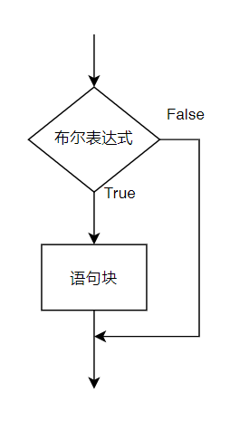
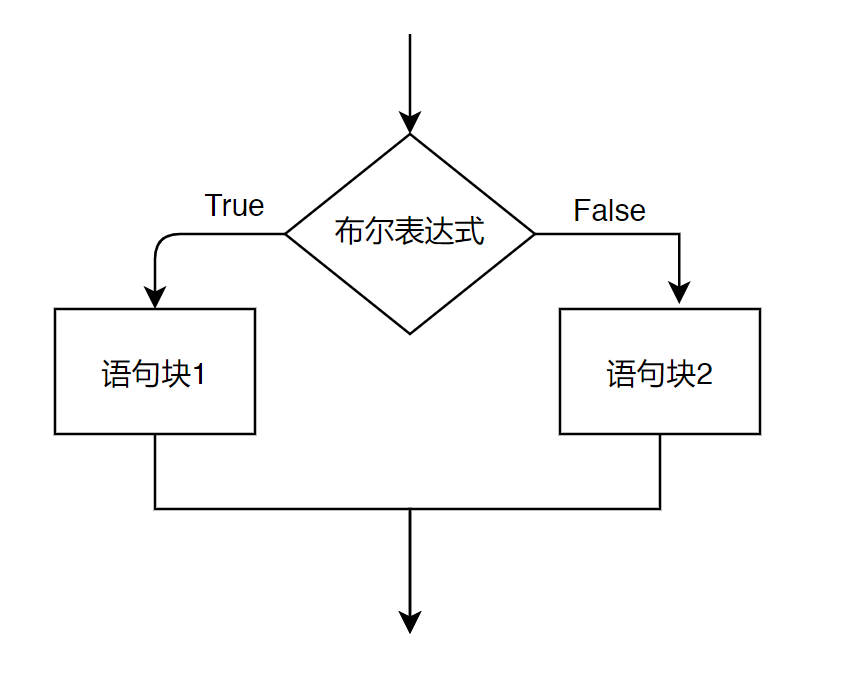
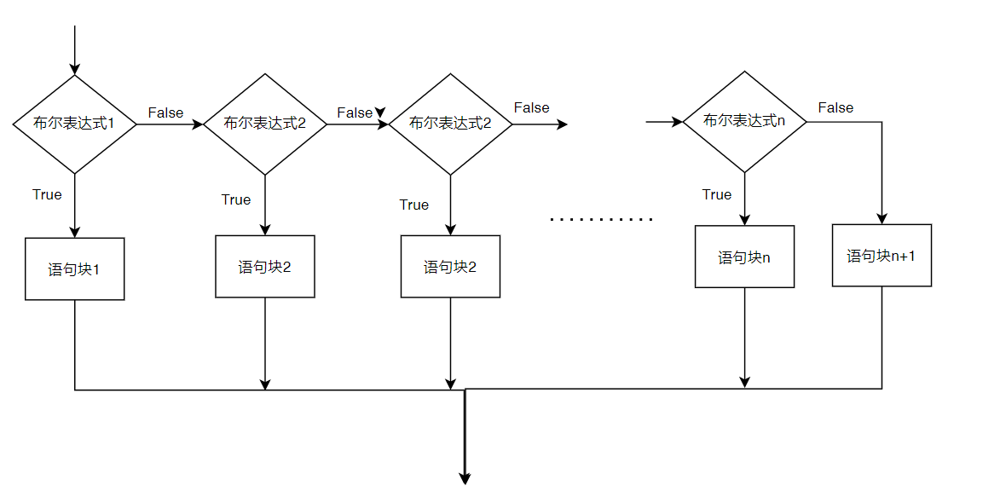
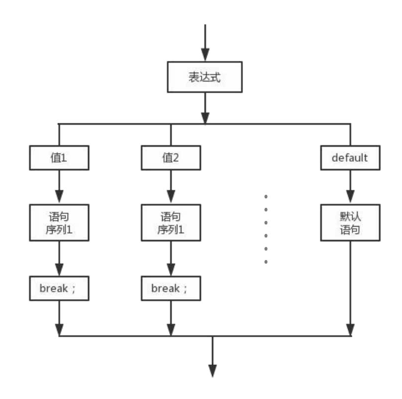
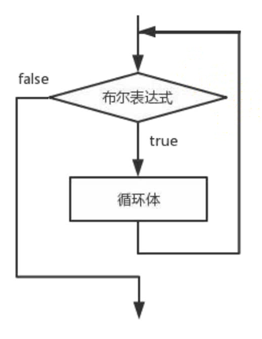
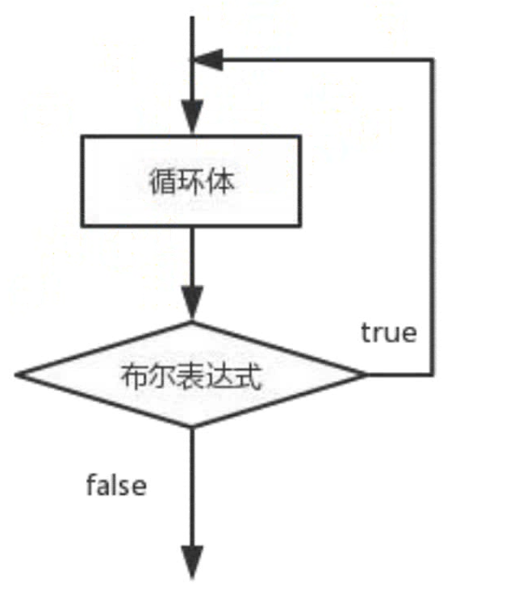
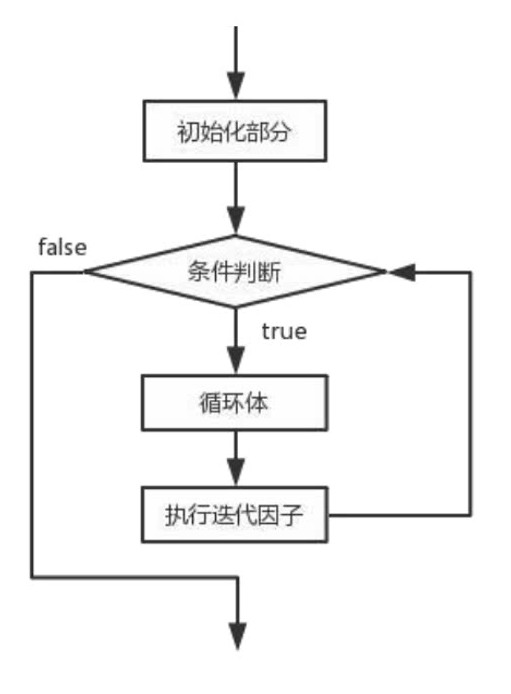

# 控制语句


## 三种程序结构


> ### `顺序结构`
>
> 顺序结构的程序是`从上而下`一行一行执行的，一条语句执行完之后继续执行下一条语句，直到程序最后
>
> ### `分支结构`
>
> 分支结构就是在执行过程中可以`分几条路径`执行
>
> ### `循环结构`
>
> 循环结构就是可以`循环执行`
>


## 1条件判断结构


### `1.1 if单分支结构`

#### 1.1.1**语法结构**

```java
if (布尔表达式){
    语句块
}
```

> `首先`计算表达式的值
>
> 如果关系表达式的值为`true`就执行`语句体`
>
> 如果关系表达式的值为`false`就`不执行语句体`
>




```java
int i = 10;
if ( i >= 100 ){
    System.out.println("i的值大于100");
}
System.out.println("程序执行完毕");
//结果
//程序执行完毕
```


### `1.2 if-else双分支语句`

#### 1.2.1**语法结构**

```java
if (布尔表达式){
    语句块1
}else{
    语句块2
}
```

> `首先`计算表达式的值
>
> 如果关系表达式的值为`true`就`执行语句体1`
>
> 如果关系表达式的值为`false`就`执行语句体2`
>
> `继续执行`后面的语句内容




```java
int i = 200;
if ( i >= 100 ){
    System.out.println("i的值大于100");
}else {
    System.out.println("i的值小于100");
}
System.out.println("程序执行完毕");
//结果
//i的值大于100
//程序执行完毕
```


#### **`练习`**

> 要求：任意给出一个整数，请用程序实现判断该整数是奇数还是偶数，并在控制台输出该整数是奇数还是偶数
>

```java
Scanner sc = new Scanner(System.in);
System.out.println("请输入一个整数");
int num = sc.nextInt();
if ( num % 2 == 0 ) {
    System.out.println("你输入的数是偶数");
}else {
    System.out.println("你输入的数是奇数");
}
```


### `1.3 if-else if多分支结构`

#### 1.3.1**语法结构**

```java
if (布尔表达式1){
    语句块1
}else if (布尔表达式2){
    语句块2
}else if (布尔表达式n){
    语句块n
}else{
    语句块n+1
}
```


 


#### `案例`

> 小明快要期末考试了，小明爸爸对他说。会根据他不同考试成绩，送他不同的礼物。请用程序实现小明到底该获得什么样的礼物，并在控制台输出
>

```java
Scanner sc = new Scanner(System.in);
System.out.println("请输入考试成绩");
int grades = sc.nextInt();
if ( grades < 60 ) {
    System.out.println("揍一顿");
}else if ( grades >= 60 && grades < 80 ){
    System.out.println("奖励文具盒一个");
}else if ( grades >= 80 && grades < 90 ){
    System.out.println("奖励自行车一辆");
}else{
    System.out.println("奖励遥控飞机一架");
}
```


## 2switch语句

### `2.1 语法结构`

```java
switch (表达式) {
    case 值1:
        语句序列1;
        [break;]
    case 值2:
        语句序列2;
        [break;]
        ……
    [default :默认语句]
}
```




### `案例`

> 需求：一年有12个月，分别属于春夏秋冬四个季节，键盘录入一个月份。请用程序实现，判断该月份属于哪个季节并输出
>
> 春：3、4、5
>
> 夏：6、7、8
>
> 秋：9、10、11
>
> 冬：12、1、2
>

```java
Scanner sc = new Scanner(System.in);
System.out.println("请输入月份");
int month = sc.nextInt();
switch (month){
    case 3:
    case 4:
    case 5:
        System.out.println("您输入的月份季节是：春季");
        break;
    case 6:
    case 7:
    case 8:
        System.out.println("您输入的月份季节是：夏季");
        break;
    case 9:
    case 10:
    case 11:
        System.out.println("您输入的月份季节是：秋季");
        break;
    case 1:
    case 2:
    case 12:
        System.out.println("您输入的月份季节是：冬季");
        break;
    default:
        System.out.println("您输入的月份有误！");
        break;
}
```


### `注意事项`

> `多个`case后面的数据`不可以重复`
>
> switch小括号当中`只能是`下列数据类型：byte、short、char、int、String、enum
>
> `前后顺序可以颠倒`，而且`break语句`还`可以省略`
>
> switch`不能对long类型`，`boolean类型`进行判断
>
> switch中`default可以在任意位置`
>
> 如果case中`没有break`，则会出现`穿透`的现象
>


## 3循环结构（while）

#### `3.1.1 语法结构`

```java
初始化语句;
while(条件判断语句){
    循环体语句;
    条件控制语句;
}
```

#### `3.1.2 执行流程`

> 1. 执行`初始化`语句
> 2. 执行`条件判断`语句，看其结果是true还是false。如果是`false`，`循环结束`；如果是`true`，`继续执行`
> 3. `执行循环体`语句
> 4. `执行条件控制`语句
> 5. 回到2继续
>



#### `案例1`

> 在控制台输出5次Hello world
>

```java
int i = 1;
while ( i <= 5 ){
    System.out.println("Hello World");
    i++;
}
```

#### `案例2`

> 循环输出200到1000之间，能被5整除的数
>

```java
int i = 200;
while ( i <= 1000 ){
    if ( i % 5 == 0 ){
        System.out.println(i);
    }
    i++;
}
```


### `3.2 do-while循环`

#### 3.2.1语法结构

```java
初始化语句;
do{
    循环体语句;
    条件控制语句;
}while (条件判断语句);
```


#### 3.2.2执行流程

> 1. 执行`初始化`语句
> 2. 执行`循环体`语句
> 3. 执行`条件控制`语句
> 4. 执行条件判断语句，看其结果是true还是false。如果是`false`，循环`结束`；如果是`true`，`继续执行`
> 5. 回到2继续
>


> do-while特点：`先执行后判断`，`至少`保证循环体会执行一次
>





## 4循环结构（for）

### `4.1语法结构`

```java
for (初始表达式;布尔表达式;迭代因子){
    循环体;
}
```

### `4.2 执行流程`

> 1. 执行`初始化`语句
> 2. 执行条件判断语句，看其结果是true还是false。如果是`false`，循环`结束`；如果是`true`，`继续执行`
> 3. 执行`循环体`语句
> 4. 执行`迭代因子`
> 5. 回到2继续
>




### `案例`

> 求1-100之间的偶数和
>

```java
int sum = 0;
for ( int i = 1; i <= 100, i++){
    if ( i % 2 == 0 ){
        sum += i;
    }
}
System.out.println(sum);
```


## 三种循环区别

> while：`先判断`条件，满足就执行循环体，不满足就退出
>
> do-while：`先执行一次循环体`，再判断条件。如果条件满足，继续执行。如果不满足，退出循环，至少执行一次
>
> for：首先会`初始化变量`，然后`判断条件`。满足条件，执行循环体，然后`执行增量`，再次判断条件。满足继续执行循环体，再次判断条件。初始化只有进入循环的第一次运行
>


## 5嵌套循环

> 在一个循环语句内部再嵌套一个或多个循环，成为嵌套循环
>
> while、do-while与for循环可以任意嵌套多层，一般多见的就是两层
>


### `案例`

>  打印5行5列的数字内容
>

```java
for ( int i = 1; i <= 5; i++ ){
    for (int j = 1; j <= 5; j++ ){
        System.out.println( j + "\t" );
    }
    System.out.println();
}
```


## 6 break语句和continue

### `6.1 break`

> `跳出`循环，`结束`循环，在任何循环语句主体部分均可用break控制循环的流程
>
> break用于强行`退出`循环，不执行循环中剩余的语句
>


#### `案例`

```java
for ( int i = 1; i <= 10; i++ ){
    if ( i == 5 ){
        break;
    }
    System.out.print(i);
}
//结果 1 2 3 4 因为执行到i==5，break掉了，结束了循环
```


### `6.2 continue`

>  `跳过本次`循环，`继续下次`循环
>

```java
for ( int i = 1; i <= 10; i++ ){
    if ( i == 5 ){
        continue;
    }
    System.out.print(i);
}
//结果 1 2 3 4 6 7 8 9 10，没有5，因为执行到i==5，continue了，跳转下一次循环
```


## 常见错误 


> ### 无限死循环
>
> ### 变量作用域