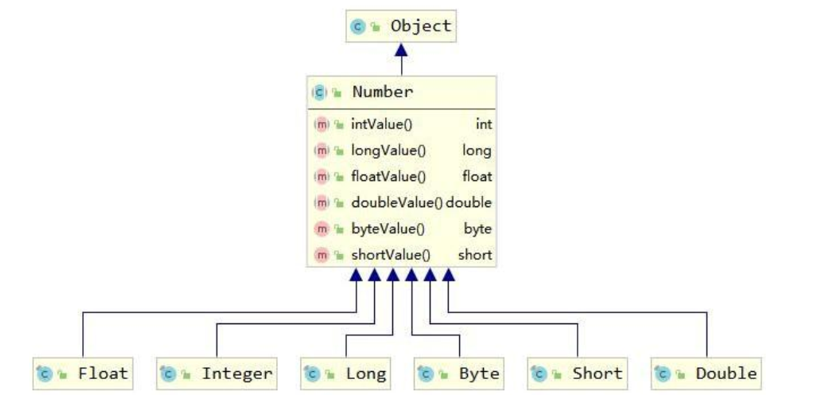
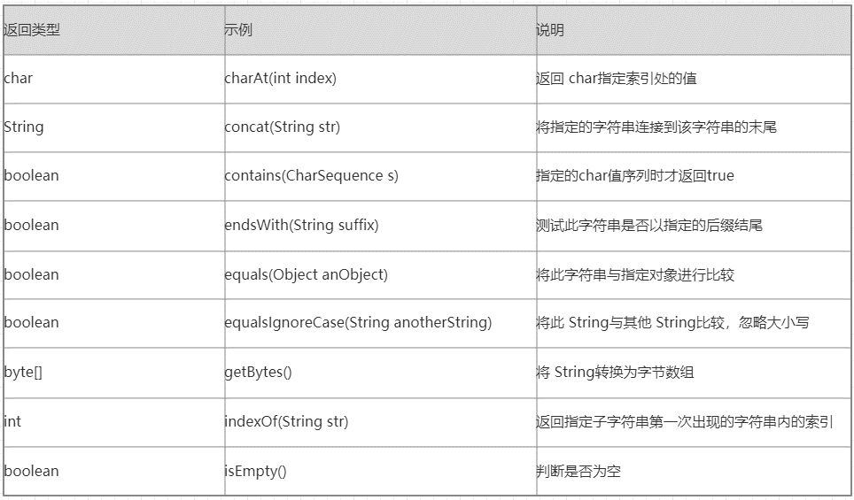
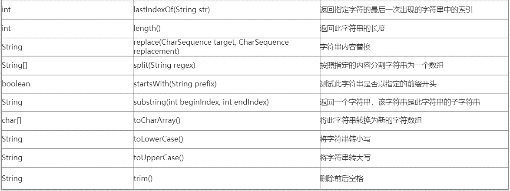
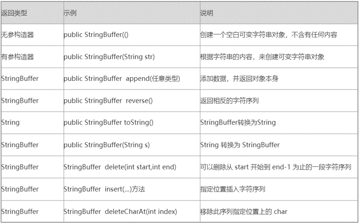
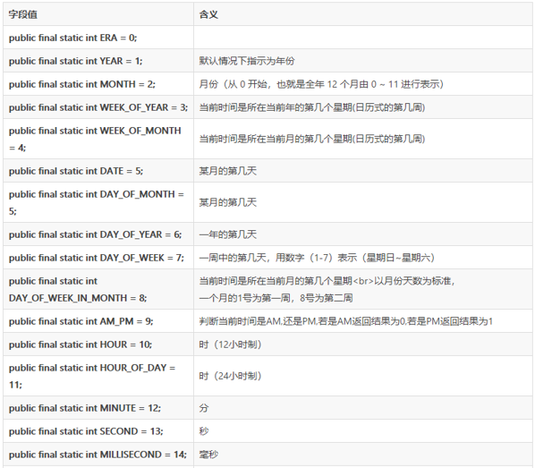
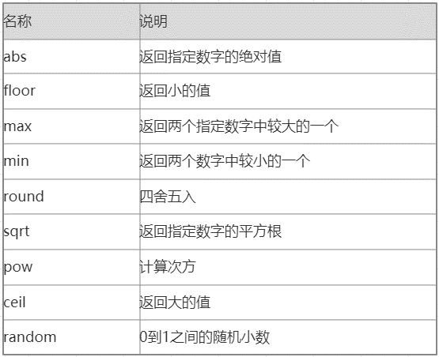

# 常用API

>1. 什么是API：API (Application Programming Interface) ：`应用程序编程接口`
>2. java中的API：指的就是 JDK 中提供的`各种功能`的 Java类，这些类将底层的实现封装了起来，我们不需要关心这些类是如何实现的，只需要学习这些类`如何使用`即可，我们可以通过`帮助文档`来学习这些API如何使用

**`Java API 文档`**


## 1 包装类

### `1.1 基本数据类型对应的包装类`

| 基本数据类型 |  包装类   |
| :----------: | :-------: |
|     byte     |   Byte    |
|   boolean    |  Boolean  |
|    short     |   Short   |
|     char     | Character |
|     int      |  Integer  |
|     long     |   Long    |
|    float     |   Float   |
|    double    |  Double   |

> 包装类均位于 java.long 包
>
> 在这八个类中，除了 Character 和 Boolean 以外其他的都是数字型，数字型都java.lang.Number 的子类

### `1.2 Number类`



> Number 类提供了抽象方法：
>
> intValue()、longValue()、floatValue()、doubleValue()，意味着所有的`“数字型”`包装类都可以`互相转型`

 

**`示例1：创建包装类`**

```java
Integer i = new Interger(10);
Integer j = new Interger(20);
```

 

**`示例2：类型相互转换`**

```java
int i = 10;
Integer j = Interger.valueOf(i);
Integer x = Interger.valueOf(100);
int y = intValue(x);

String s = "123";
Integer snum = Integer.parseInt(s);

Integer z = Interger.valueOf(100);
String s2 = z.toString;
```


### `1.3 自动装箱/拆箱`

> 自动装箱和拆箱就是将`基本数据类型`和`包装类`之间进行自动的`互相转换`。
>
> JDK`1.5 `后，Java 引入了自动装箱和自动拆箱

 ```java
 //自动装箱
 Integer i = 5;//Integer i = Interger.valueOf(5);
 
 //自动拆箱
 int j = i;//int j = intValue(i);
 
 ```


## 2 字符串相关类

>1. String表示字符串,所谓字符串,就是一连串的字符（例如“abc”）
>2. String 类在 java.lang 包下，所以使用的时候`不需要导包`！
>3. String是`不可变`类，一旦String对象被创建，包含在对象中的字符序列(内容)是不可变的，直到对象被销毁






### `String对象创建的两种方式`


#### **方式一**

```java
String str = new String("aaa");
```

> **此方法创建了几个对象？**
>
> `2个！`
>
> 在`堆`里有一个“aaa”
>
> 在`常量池`里有一个“aaa”

 


#### **方式二**

```java
String str = "aaa";
```

> **此方法创建了几个对象？**
>
> `1个！`
>
> 在`常量池`里有一个“aaa”


### `String常见面试题`


**1. 创建了几个对象？**

```java
String a = "123" + "456";
```

> 创建了`1个`对象
>
> jvm编译阶段过编译器优化后会把字符串常量`直接合并`成"123456"，`所有`创建对象时`最多`会在常量池中创建`1个`对象


**2. 创建了几个对象？**

```java
String a = "123" + new String("456");
```

> 创建了`4个`对象
>
> "123"和"456"会`先创建常量池中2个对象`，`new`之后会在`堆中`存放"456"，`常量连接堆对象`，最终会一起`拼接后`，在`堆中创建堆对象"123456"`


**3. 创建了几个对象？**

```java
String str1 = new String("aaa");
String str2 = new String("aaa");
```

> 创建了`3个`对象
>
> `常量池`对象“aaa”
> `new` String(“aaa”)创建`2个堆对象`


### `String对象判断`

**`示例`**

```java
//编译器做了优化,直接在编译的时候将字符串进行拼接
String str1 = "hello" + " java";//相当于 str1 = "hello java";
String str2 = "hello java";
System.out.println(str1 == str2);//true

String str3 = "hello";
String str4 = " java";
//编译的时候不知道变量中存储的是什么,所以没办法在编译的时候优化
String str5 = str3 + str4;
System.out.println(str2 == str5);//false

```


### `StringBuffer与StringBuilder`

> StringBuffer与StringBuilder是`可变`的字符序列，方便用户进行`内容修改`
>
> StringBuffer与StringBuilder都继承AbstractStringBuilder，所有下面方法可以通用



```java
//1、创建对象
StringBuffer sbf = new StringBuffer("aaa");


//添加
sbf.append(111);
sbf.append("bbb");//sbf.toString aaa111bbb


//反转
sbf.reverse();//sbf.toString bbb111aaa


//删除
sbf.delete(0,1);//sbf.toString bb111aaa 前开后闭


//插入
sbf.insert(1,"你好");//sbf.toString b你好b111aaa


//deleteCharAt()
sbf.deleteCharAt(3);//sbf.toString b你好111aaa
```


### `String、StringBuffer、StringBuilder三者之间的区别`

> **String**
>
> String是字符串`常量`，由String创建的字符内容是`不可改变`的。String内部是由`char数组实现`的，这个char数组有`final`修饰符。所以String创建的字符串对象内容是不可变的

> **StringBuffer**
>
> JDK1.0 版本提供的类,内部字符数组没有用 final 修饰 ,是可变字符序列，`线程安全`，做线程同步检查， `效率较低 `

>**StringBuilder**
>
>JDK1.5 版本提供的类，内部字符数组没有用 final 修饰 ,是可变字符序列，`线程不安全`，不做线程同步检查，因此`效率较高`，`建议采用`该类 


### `String与StringBuffer性能比较`

> 通过用String +的方式连接100000个长度的字符串
>
> 通过用StringBuffer.append的方式连接100000个长度的字符串
>
> 观察计算运行耗时间

```java

String s = "";
//记录开始时间
long begintime = System.currentTimeMillis();
//每次为s字符串拼接当前i作为新字符串，循环100000次
for(int i = 1;i <= 100000;i++){
    s += i;
}
//记录结束时间
long endtime = System.currentTimeMillis();
//总用时
long time = endtime - begintime;
System.out.println("运行时间为："+time);


System.out.println("=======================");


//使用StringBuffer做相同的实验
StringBuffer s1 = new StringBuffer();
s = "";
begintime = System.currentTimeMillis();
for(int i = 1;i <= 100000;i++){
    s = ""+i;
    s1 = new StringBuffer(s);       
}
endtime = System.currentTimeMillis();
time = endtime - begintime;
System.out.println("运行时间为："+time);
```

> String  +号拼接大约需要StringBuffer时间的140倍


## 3 Date时间类

> Date 表示`特定`的`瞬间`，精确到`毫秒`

> 1. 年：Date类的年份从`1900`开始算,也就是Date类的年份为y,那么现实世界就是` y +1900 `表示
> 2. 月：月份由从 0 至 11 的整数表示，也就是`0 是一月`、1 是二月等等；因此 11 是十二月
> 3. 日：由整数 1 至 31 表示，这点和现实世界一致
> 4. 小时：小时由从 0 至 23 的整数表示
> 5. 分钟：分钟按通常方式由 0 至 59 的整数表示
> 6. 秒：秒由 0 至 60 的整数表示


### `3.1 Calendar时间类`

> java中时间类主要有Date、Calendar
>
> Java官方推荐Calendar来替换Date的使用
>
> `实际开发`中，使用`Date`较多
>
> Calendar`功能更强大`




### `3.2 DateFormat类`

> 把`时间对象`转化成`指定格式`的`字符串`。反之，把指定格式的字符串转化成时间对象。
>
> DateFormat 是一个`抽象类`，一般使用它的的子类 `SimpleDateFormat` 类来实现

```java
SimpleDateFormat dfm = new SimpleDateFormat("yyyy-MM-dd HH:mm:ss");
Date date = new Date();
String strDate = dfm.format(date);
System.out.println(strDate);
//会根据给定输出格式输出当前时间
```

```java
String str = "2021-06-01 12:12:12";
SimpleDateFormat dfm = new SimpleDateFormat("yyyy-MM-dd HH:mm:ss");
Date date = dfm.parse(str);
```


#### `SimpleDateFormat参数表`

| 字母 | 日期或时间元素                         | 表示   | 示例          |
| ---- | -------------------------------------- | ------ | ------------- |
| G    | Era 标志符                             | Text   | AD            |
| y    | 年                                     | Year   | 1996; 96      |
| M    | 年中的月份                             | Month  | July; Jul; 07 |
| w    | 年中的周数                             | Number | 27            |
| W    | 月份中的周数                           | Number | 2             |
| D    | 年中的天数                             | Number | 189           |
| d    | 月份中的天数                           | Number | 10            |
| F    | 月份中的星期                           | Number | 2             |
| E    | 星期中的天数                           | Text   | Tuesday; Tue  |
| a    | Am/pm 标记                             | Text   | PM            |
| H    | 一天中的小时数（0-23）                 | Number | 0             |
| k    | 一天中的小时数（1-24）                 | Number | 24            |
| K    | am(中午)/pm（下午） 中的小时数（0-11） | Number | 0             |
| h    | am(中午)/pm（下午） 中的小时数（1-12） | Number | 12            |
| m    | 小时中的分钟数                         | Number | 30            |
| s    | 分钟中的秒数                           | Number | 55            |
| S    | 毫秒数                                 | Number | 978           |


## 4 Math类

> 提供了一系列静态方法用于`科学计算`



```java
//向上取整
System.out.println(Math.ceil(9.1));//10.0

//向下取整
System.out.println(Math.floor(9.9));//9.0

//取大
System.out.println(Math.max(10,20));//20

//四舍五入
System.out.println(Math.round(2.4));//2

```


