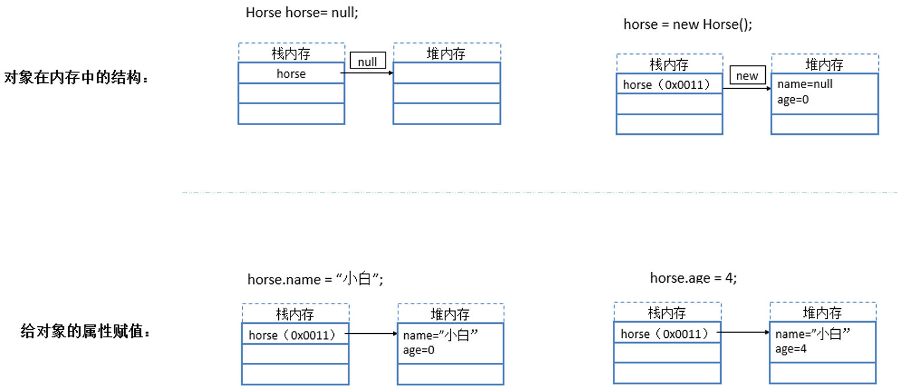
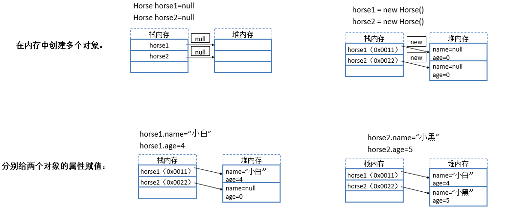
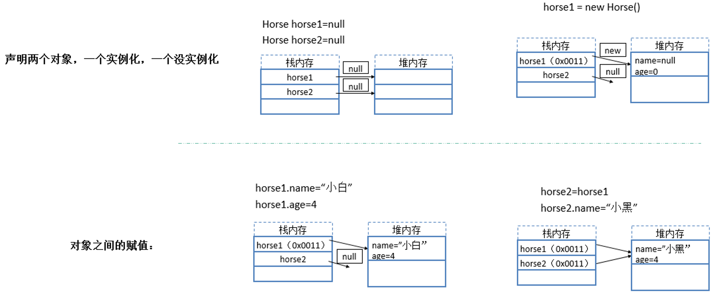
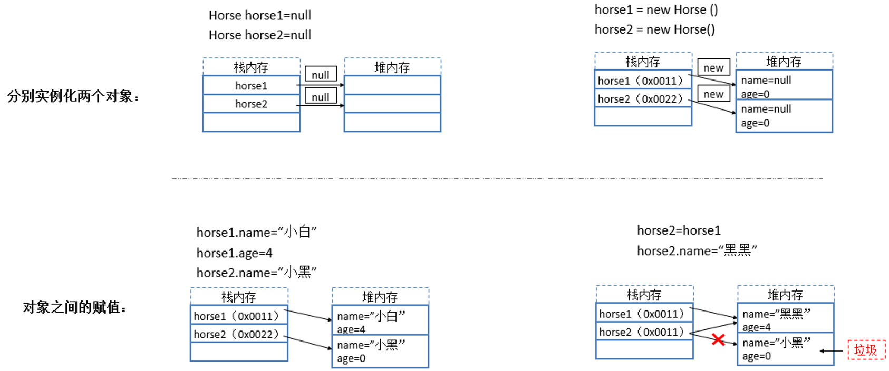
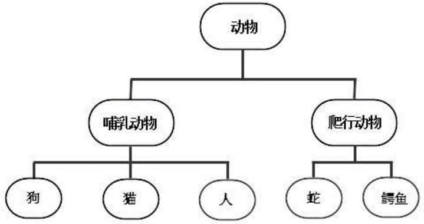
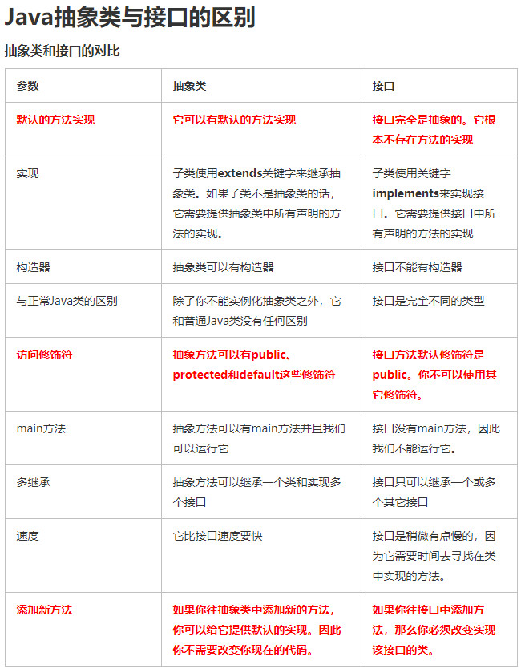

# 面向对象


## 1 面向对象基本概念


### `1.1 概念`

> 面向对象是一种编程思维，也是一种思考问题的方式


> `OOA：`面向对象分析  Object-Oriented Analysi
>
> `OOD：`面向对象设计  Object-Oriented Design
>
> `OOP：`面向对象编程  Object-Oriented Programming


------

### `1.2 面向过程与面向对象的区别`

> 面向`过程`
>
> 强调的是一种`行为`，一种`过程`，先干啥，再干啥（执行者）

> 面向`对象`
>
> 强调的是具备功能的`对象`（管理者）

>**`区别`**
>
>1. 都是解决问题的思维方式
>2. 面向过程是一种“`执行者`思维”，解决简单问题可以使用面向过程。 
>3.  面向对象是一种“`设计者`思维”，解决复杂、需要协作的问题可以使面向对象
>4. 面向对象`离不开`面向`过程  `
>5. 宏观上：通过面向对象进行`整体设计  `
>6. 微观上：`执行`和`处理`数据，仍然是面向`过程`。


### `1.3 面向对象的思维`

> - 先整体、再局部
> - 先抽象、再具体
> - 能做什么、再做什么


### `1.4 面向对象的三个特征`

> - **封装**
> - **继承**
> - **多态**


## 2 类与对象

>**类**
>
>类是一种`分类`，一个`类别`，一个`模板`，它描述一类对象的`行为`和`状态`，是一组具有相同特性（属性）与行为（方法）的事物`集合`

> **对象**
>
> 对象是一个你能够看得见摸得着`真实存在`的具体`实体`,`万事万物皆对象`


### `2.1 举例`


------

### `2.2 类的定义格式`

**`语法结构`**

```java
修饰符 class 类名{
    属性;
    方法(){};
}
```

```java
public class Person{
    private String name;
    public void show(){
        
    }
}
```


------

### `2.3 对象的定义格式`

#### 2.3.1 声明对象

```java
类名    对象名;
Person p1;
```

#### 2.3.2 开辟空间

```  java
对象名  =  new 类名();
p1 = new Person();
```

#### 2.3.3 属性赋值

```java
对象名.属性名 = 值;
p1.name = "张三";
```

> 访问类中的`属性`：对象.属性;
>
> 访问类中的`方法`：对象.方法（）;

> 声明对象：在栈空间中放入对象
>
> 开辟空间：在堆空间中开辟内存空间，并使对象指向该堆空间地址


### `2.4 对象定义的两种格式`

> **声明对象：**
>
> Person p = null;
>
> 表示声明了一个对象,但是此对象无法使用，p没有具体的内存指向

> **实例化对象：**
>
> Person p = new Person();
>
> 表示实例化了对象，可以使用
>
> new 关键字表示创建一个对象
>  new 关键字表示实例化对象
>  new 关键字表示申请内存空间


### `2.5 对象与内存分析`


> 分析一




> 分析二



> 分析三



> 分析四




> 1. new关键字表示向`内存申请空间`，也表示`实例化`一个对象，`创建`一个对象
> 2. 在`确定不使用`对象时，要尽早`释放`对象：引用=null
> 3. 相同的类型才可以赋值
> 4. `不同的引用`，指向`同一个`对象，任何一个引用`改变`对象的值，其它引用`都会`反映出来
> 5. 当一个堆中的对象`没有被任何引用`时，该对象会被JVM的GC程序认为是垃圾对象，从而被回收
> 6. 先有类，然后再有对象


## 3 封装

> `封装`是面向对象`三大特征`之一
>
> 作用是"`信息隐藏`", 把`不需要`让外界知道的信息`隐藏`起来,尽可能隐藏对象功能`实现细节`

> 封装的`优势`
>
> - 提高代码的`安全`性
> - 提高代码的可`维护`性
> - 提高代码的`复用`性
> - 提高代码的可`扩展`性


### `3.1 封装要点`

> 1. **属性私有化**
>
> 2. **提供公有的get和set方法**
>
>    get变量名()方法：用于获取成员变量的值
>
>    set变量名(参数)方法：用于设置成员变量的值


#### 3.1.1 未进行封装的代码演示

```java
public class Person{
    public String name;
}

public class Test{
    public static void main(String[] args){
        Person p = new Person();
        p.name = "张三";
        System.out.println(a.name);//张三
    }
}
```


#### 3.1.2 使用封装后的代码演示

```java
public class Person{
    private String name;
    
    public String getName() {
        return name;
    }

    public void setName(String name) {
        this.name = name;
    }
    
}

public class Test{
    public static void main(String[] args){
        Person p = new Person();
        p.name = "张三";//错误，不能直接访问
        p.setName("张三");
        System.out.println(p.getName());//张三
    }
}
```


### `3.2 成员变量和局部变量的区别`

> **在类中的位置不同**
>
> `成员变量：`
>
> 在类中定义
>
> `局部变量：`
>
> 在方法中定义或者方法的参数

> **在内存中的位置不同**
>
> `成员变量：`
>
> 在堆内存(成员变量属于对象，对象进堆内存)
>
> `局部变量：`
>
> 在栈内存(局部变量属于方法，方法进栈内存)

> **生命周期不同**
>
> `成员变量：`
>
> 随着对象的创建而存在，随着对象的销毁而消失
>
> `局部变量：`
>
> 随着方法的调用而存在，随着方法的调用完毕而消失

> **初始化值不同**
>
> `成员变量：`
>
> 有默认初始化值，引用类型默认为null
>
> `局部变量：`
>
> 没有默认初始化值，必须定义，赋值，然后才能使用


## 4 构造方法

> 构造方法是一种特殊的方法，方法名与类名`同名`

`语法结构`

```java
public class 类名{
    修饰符 类名(){
        
    }
}


public class Person{
    public Person(){
        
    }
}
```

> **构造方法作用：**
>
> 1. 创建对象：Person stu = new Person();
> 2. 初始化数据：完成对象数据的初始化操作


### `4.1 构造方法分类`

`无参构造方法`

```java
public  Person(){
}
```

`带参构造方法`

```java
public Person(String name,int age){
	this.name = name;
	this.age = age;
}
```


### `4.2 注意事项`

> 1. 构造方法名称与`类名相同`，`没有返回值`声明（`包括 void`）
> 2.  构造方法用于`初始化`数据（属性）
> 3.  每一个类中都会有一个`默认`的`无参`的构造方法
> 4.  如果类中`有`显示的`构造方法`，那么`默认`构造方法将`无效`
> 5.  如果有显示的构造方法，还想保留默认构造方法，需要显示的`写出来`
> 6.  构造方法可以`有多个`，但`参数不一样`，称为构造方法的`重载`
> 7.  在构造方法中调用另一个构造方法，使用this(...)，该句代码必须在第一句。
> 8.  构造方法之间的调用，必须要有出口。
> 9.  给对象初始化数据可以使用构造方法或setter方法，通常情况下，两者都会保留。
> 10.  一个好的编程习惯是要保留默认的构造方法。（为了方便一些框架代码使用反射来创建对象）
> 11.  private Person(){}，构造方法私有化，当我们的需求是为了 保正该类只有一个对象时（单例模式就是私有化构造器）。

### `4.3 优先级别`

> 静态块、语句块、构造块的优先级别

```java
public class Dog{
    
    public Dog(){
        System.out.println("构造方法");
    }
    
    {
        System.out.println("代码块");
    }
    
    static{
        System.out.println("静态代码块");
    }
}
```

> 1. 静态代码块
> 2. 代码块
> 3. 构造方法


### `4.4 举例说明(不太恰当，仅供理解)`

> 数据就像是菜
>
> 封装就像是去餐厅，不是在自己家，触碰不到菜
>
> 你去餐厅是不能自己去后厨端菜的
>
> get就像是服务员上菜，他帮你去后厨拿'数据'  // 你桌上的菜=餐厅.服务员上菜( ) ;
>
> set就像是服务员点菜，他帮你改变后厨的'数据'  // 餐厅.服务员点菜( ) ;
>
> 类中的方法就像是餐厅提供的一些服务，比如说show方法
>
> 就像是回转寿司，餐厅是可以直接处理你的菜
>
> 他选择把菜放到履带上  // 餐厅.服务员把菜放到转盘上( ) ;
>
> 也可以达成让你看到你点的菜的目的
>
> 构造方法就像是我没看菜单，但我知道我想吃什么
>
> 比如每次去肯德基只吃全家桶
>
> 就可以//  new 肯德基（点菜全家桶）;


## 5 this static关键字

### `5.1 this关键字`

> 表示为`当前对象`的引用，换言之，谁调用了方法，谁就是当前对象引用

> **应用场景**
>
> - 调用类中的`属性`：this.属性名称，指的是访问类中的成员变量，用来区分成员变量和局部变量（重名问题）
> - 调用类中的`方法`：this.方法名称，用来访问本类的成员方法
> - 调用类构造`方法`：this();访问本类的构造方法，()中可以有参数的 如果有参数 就是调用指定的有参构造

> **注意事项**
>
> 1. this() `不能`使用在`普通方法`中，`只能`写在`构造`方法中
> 2. 必须是构造方法中的`第一条`语句


### `5.2 static关键字`

> 使用static修饰属性，属性叫类变量或者`静态变量`
>
> 使用static修饰方法，方法叫类方法或者`静态方法`


```java
public class Test01 {    
    public void test01(){
        TestStatic.show();
        System.out.println(TestStatic.PI_);
    }
}

class TestStatic {
    
    public static final double PI_=3.14;
    
    public static void show() {
        System.out.println("π的值为：");
    }
    
}
```


> `访问方式`
>
> 1. 类.字段、类.方法()
> 2. 对象名.字段、对象名.方法名()

> `特点`
>
> 1. 随着类的加载而加载
> 2. 优先于对象存在
> 3. 被所有对象所共享
> 4. 可以直接被类名调用

> `注意事项`
>
> 1. 静态方法只能访问静态成员
> 2. 非静态方法即可以访问静态成员也可以访问非静态成员
> 3. 静态方法中不可以使用this，super关键字

> `小结`
>
> 1. static 修饰的字段和方法，既可以通过类调用，也可以使用实例调用；
> 2. 没static 修饰的字段和方法，只能使用实例来调用
> 3. static关键字不能与this，super同时连用！


## 6 值传递与引用传递

### `6.1 基本数据类型的按值传递`

> 在java中只有按值传递，并没有所谓的按引用传递

```java
public static void main(String[] args) {
        int x = 10;
        int y = 20;
        swap(x, y);
        System.out.println("main中的x = " + x);
        System.out.println("main中的y = " + y);
}

public static void swap(int x, int y) {
	int temp = x;
	x = y;
	y = temp;
	System.out.println("方法中的x = " + x);
	System.out.println("方法中的y = " + y);
}

//方法中的x = 20
//方法中的y = 10

//main中的x = 10
//main中的y = 20
```


> main函数中的x，y和swap函数中的x，y分别存放在`不同的区域`
>
> 在main中调用swap函数的时候，会将main中的x，y的值`赋给`swap中的x，y
>
> 当swap函数中对x，y交换时`只是`对swap帧中的x，y做`交换`
>
> `并不会改变`main中的x，y
>
> 所以当函数返回时main中的x，y并不会改变


### `6.2 引用数据类型的按值传递`

> 引用类型的按值传递，传递的是对象的地址

```java
public static void main(String[] args) {
    int[] a = {10, 20};
    System.out.println("原始 = a[0] :" + a[0] + "\ta[1] : " + a[1]);
    swap(a);
    System.out.println("交换后main中 = a[0] :" + a[0] + "\ta[1] : " + a[1]);
}

public static void swap(int[] a) {
    int temp = a[0];
    a[0] = a[1];
    a[1] = temp;
    System.out.println("交换后方法中 = a[0] :" + a[0] + "\ta[1] : " + a[1]);
}

//原始 =         a[0] :10	  a[1] : 20
//交换后方法中 = a[0] :20	   a[1] : 10
//交换后main中 = a[0] :20	a[1] : 10
```


> 在swap中仅仅是`得到`了数组的`地址`，并`没有`对数组的元素进行`复制`
>
> 在swap中对数组的操作是直接对main函数中数组的操作
>
> 因此swap函数返回后main函数中的a[0] ,a[1]的值发生交换


## 7 包

### `7.1 包的作用`

> - 解决类的`同名`问题
> - 组织源代码`便于管理`
> - `护`类、属性和方法的访问


### `7.2 包的创建`


```java
package com.augus.demo;
```


### `7.3 包规范`

> - 包的关键字`package`
>
> - 包的名字有`层次`关系，各层之间以点分隔
>
> - 包名全部使用`小写`字母
>
> - 域名`倒着`写，再加上模块名
>
>   com.sina.games
>
>   com.sohu.news


### `7.4 导入包`

> 如果我们要使用其他包的类，就需要使用` import `导入

> - 通配符`*`导入该包下`所有`的类。会降低编译速度，但不会降低运行速度
> - Java 会`默认`导入 `java.lang `包下所有的类，因此这些类我们可以直接使用
> - 如果导入两个`同名`的类，只能用包名+类名来显示调用相关类：java.util.Date date = new java.util.Date();


## 8 访问修饰符

> 用于控制被修饰`变量`、`方法`、`类的`可见范围

|  修饰符   | 同一个类中 | 同一个包中子类无关类 | 不同包的子类 | 不同包的无关类 |
| :-------: | :--------: | :------------------: | :----------: | :------------: |
|  private  |     √      |                      |              |                |
|   默认    |     √      |          √           |              |                |
| protected |     √      |          √           |      √       |                |
|  public   |     √      |          √           |      √       |       √        |


## 9 继承

> 继承是面向对象`三大特征`之一,继承让我们更加容易实现类的`扩展`,以及代码的`重用`




### `9.1 继承的好处和弊端`

> **继承好处：**
>
> 1. 提高了代码的`复用性`(多个类相同的成员可以放到同一个类中)
> 2. 提高了代码的`维护性`(如果方法的代码需要修改，修改一处即可)

> **继承弊端：**
>
> 增强了类与类之间的`耦合性`，当父类发生变化时子类实现也不得不跟着变化

> **应用场景：**
>
> 使用继承，需要考虑类与类之间是否存在`is..a`的关系，`不能盲目`使用继承


### `9.2 继承的使用`

**语法结构**

```java
[访问权限] class 父类名{    }
public class Person {...}

[访问权限] class 子类名 extends 父类名{}
public class Student extends Person {...}
```


> **案例**
>
> 公司中程序员有：姓名、工号、薪水、工作内容。
>
> 项目经理除了有：姓名、工号、薪水、还有奖金、工作内容

```java
public class Person{
    String name;
    int id;
    double salary;
    
    public void work(){
        System.out.println("姓名:" + name+",编号："+id+",工资："+salary+",人在努力工作");
    }
    
}

public class Programmer extends Person{
    
}

public class Manager extends Person{
    double bounus;
}


```


### `9.3 注意事项`

> 1. java通过继承实现代码的复用，被继承的成为`父类`或者超类（superclass）或基类，由继承而得到得到类称为`子类`(subclass)或派生类
> 2. Java中类只支持`单继承`，不支持多继承，但支持多层继承
> 3. 子类可以继承父类的成员`变量`和`成员方法`，还可以添加新的成员变量和成员方法
> 4. 所有类都是java.lang.`Object`类的子类
> 5. 子类可以从父类那里继承`所有非private`的成员作为自己的成员。
> 6. java程序在执行子类的构造方法之前，会`先调用父类中无参数的构造`方法，如果父类中没有无参构造方法，那么子类必须显示的通过super(...)来调用父类的带参构造方法，super也只能在子类构造方法中的第一句,否则编译时将出现错误信息
> 7. 构造方法是不能被继承，但是可以被子类调用，也可以可以重载，也就是说super（）会根据参数的个数和类型，执行父类相应的构造方法
> 8. super（）与this（）均在构造方法内的`第一行`，也就是由于这个原因，它们两个无法同时存在于同一个构造方法
> 9. 与this一样，super指得也是对象，所以不能在static环境中使用，包括静态方法和静态初始化器（static语块）。


## 10 方法重写

> 子类通过重写父类的方法，可以用自身的行为替换父类的行为

> 方法的重写需要符合下面的三个要点:
>
> **一同：**方法名、形参列表相同
>
> **两小：**返回值类型比父类方法的返回值类型更小或相等
>
> ​              方法抛出的异常应比父类抛出的异常更小或相等
>
> **一大：**访问权限，子类大于等于父类

> **案例**
>
> 在继承的基础上扩展

```java
public class Person{
    String name;
    int id;
    double salary;
    
    public void work(){
        System.out.println("姓名:" + name + ",编号：" + id + ",工资：" + salary + ",人在努力工作");
    }
    
    public Person(String name, int id, double salary) {
        this.name = name;
        this.id = id;
        this.salary = salary;
    }
    
}


public class Programmer extends Person{
    
    public Programmer(String name, int id, double salary) {
        super(name, id, salary);
    }
    
    @Override
    public void work() {
        System.out.println("姓名:" + name + ",编号：" + id + ",工资：" + salary + ",程序员在努力工作");
    }
    
}


public class Manager extends Person{
    double bounus;
	
    public Manager(String name, int id, double salary,double bounus) {
        super(name, id, salary);
        this.bounus = bounus;
    }
    @Override
    public void work(){
        System.out.println("姓名:" + name + ",编号：" + id + ",工资：" + salary + ",奖金: " + bounus + ",项目经理在努力工作");
    }
}

```


### `10.1 方法重载和重写的区别`

> 1. 重写在`继承`场景下发生，重载在`同一个类`场景下发生
> 2. 重写的方法名，参数数目相同，参数类型兼容，重载的方法名相同，参数列表不同
> 3. 重写的方法修饰符大于等于父类的方法，重载和修饰符无关
> 4. 重写不可以抛出父类没有抛出的异常，重载与异常抛出无关


## 11 final关键字

> final代表终极的意思，可以用来修饰【`类`、`方法`、`属性`】

> **final应用**
>
> final修饰类：类不能被继承
>
> final修饰属性：属性变成常量
>
> final修饰方法：方法不能被重写


## 12 多态

> 多态指的是同一个方法调用，由于对象`不同`可能会有`不同的行为`
>  对象多态性是从继承关系中的多个类而来


### `12.1 多态的要点`

> **3个必要条件**
>
> 继承
>
> 方法重写
>
> 父类引用指向子类对象


### `12.2 案例`

```java
public class Person{
    String name;
    int id;
    double salary;
    
    public void work(){
        System.out.println("姓名:" + name + ",编号：" + id + ",工资：" + salary + ",人在努力工作");
    }
    
    public Person(String name, int id, double salary) {
        this.name = name;
        this.id = id;
        this.salary = salary;
    }
    
}


public class Programmer extends Person{
    
    public Programmer(String name, int id, double salary) {
        super(name, id, salary);
    }
    
    @Override
    public void work() {
        System.out.println("姓名:" + name + ",编号：" + id + ",工资：" + salary + ",程序员在努力工作");
    }
    
}


public class Manager extends Person{
    double bounus;
	
    public Manager(String name, int id, double salary,double bounus) {
        super(name, id, salary);
        this.bounus = bounus;
    }
    
    @Override
    public void work(){
        System.out.println("姓名:" + name + ",编号：" + id + ",工资：" + salary + ",奖金: " + bounus + ",项目经理在努力工作");
    }
}

public class Company{
    public void work(Person person){
        person.work();
    }
}

@Test
Company company = new Company();
company.work(new Programmer("张三",1,1000));
company.work(new Manager("张三",1,1000,200));

/*
姓名:张三,编号：1,工资：1000.0,程序员在努力工作
姓名:张三,编号：1,工资：1000.0,奖金: 200.0,项目经理在努力工作
*/
```


## 13 抽象类和抽象方法

> 很多具有`相同特征`和`行为`的类可以抽象为一个抽象类
>
> 使用`abstract`关键字声明的类为抽象类

**语法结构**

```java
修饰符  abstract class   抽象类名{
　　修饰符 abstract 返回值 抽象方法();
}

public  abstract class  Person{
　　public abstract void eat();
}

```


### `案例`

```java
public abstract class Person{
    String name;
    int id;
    double salary;
    
    public void work(){
        System.out.println("姓名:" + name + ",编号：" + id + ",工资：" + salary + ",人在努力工作");
    }
}


public class Programmer extends Person{

    @Override
    public void work() {
        System.out.println("程序员在努力工作");
    }
    
}


public class Manager extends Person{
    double bounus;
	
    @Override
    public void work(){
        System.out.println("项目经理在努力工作");
    }
}


@Test
Person manager = new Manager();
person programmer = new Programmer();
manager.work();
programmer.work();

/*
项目经理在努力工作
程序员在努力工作
*/
```


### `抽象类的规则`

> 1. 抽象方法和抽象类都必须被`abstract`关键字修饰
> 2. 抽象类`可以没有`抽象方法，包含抽象方法的类`一定是`抽象类
> 3. 非抽象类继承抽象类必须`实现所有`抽象方法
> 4. 抽象类可以继承抽象类，可以不实现父类抽象方法。
> 5. 抽象类`可以有`方法实现和属性
> 6. 抽象类`不能`被实例化
> 7. 抽象类`不能`声明为final
> 8. 抽象类`可以有`构造方法


## 14 接口

> 接口就是比“抽象类”还“抽象”的“抽象类”
>
> 可以更加规范的对子类进行约束,全面地实现了：规范和具体实现的分离

**语法结构**

```java
修饰符 interface 接口名{
	// 静态常量
   	 // 抽象方法
}

public interface  Fly {
	int FLY_HIGHT= 100; // public static final
	void fly(); //public abstract void fly();
}
```


**实现格式**

```java
修饰符 class 类名 implements 接口名{
	实现接口方法
}

public class SuperMan implements Fly{
	public void fly() {
		System.out.println("超人正在天空飞！！！");
	}		
}
```


### `案例`

```java
public interface Eat {
    void eat();
}


public interface Fly {
    int FLY_HEIGHT = 100;
    void fly();
}


public interface Say extends Eat{
    void say();
}


public class SuperMan implements Fly,Say{
    @Override
    public void fly() {
        System.out.println("超人在飞！");
    }

    @Override
    public void say() {
        System.out.println("我是超人，我来自美国！");
    }

    @Override
    public void eat() {
        System.out.println("超人吃饭");
    }
}


public class Bird implements Fly,Say {
    @Override
    public void fly() {
        System.out.println("鸟在飞");
    }

    @Override
    public void say() {
        System.out.println("我虽然是鸟，但我会叫喳喳！");
    }

    @Override
    public void eat() {
        System.out.println("小鸟吃虫子");
    }
}

@Test
Fly fly = new SuperMan();
fly.fly();
Say say = new SuperMan();
say.say();
Eat eat = new SuperMan();
eat.eat();

/*
超人在飞！
我是超人，我来自美国！
超人吃饭
*/

```


### `特征`

> 1. 定义一个接口，使用`interface`关键字
> 2. 在一个接口中，只能定义`常量`、`抽象方法`，`JDK1.8后可以定义默认的实现方法`
> 3. 接口可以`继承多个接口`：extends xxx,xxx
> 4. 一个具体类实现接口使用`implements`关键字
> 5. 一个类只能继承一个直接的父类,但可以`实现多个`接口,间接的实现了多继承.
> 6. 当类实现了某个Java接口时,它`必须实现`接口中的`所有`抽象方法,`否则`这个类必须声明为`抽象类`
> 7. 在接口中定义的方法`没有`声明 访问`修饰符`，默认为public
> 8. 接口不能有构造方法，接口不能被实例化
> 9. 类 extends 类，类 implements 接口，接口 extends 接口，当同时出现extends和implements时，先extends后implements


### `接口与抽象类区别（重要）`





## 15 内部类

> **内部类就是在一个`类的内部`定义的类**
>
> 内部类仍然是一个`独立`的类，在编译之后会内部类会`被编译`成`独立的`.class文件，但是前面冠以外部类的类命和$符号
>
> 内部类可以`自由`地`访问`外部类的成员变量，无论是否是private的

> **作用**
>
> 内部类提供了更好的`封装`。只能让外部类直接访问，不允许同一个包中的其他类直接访问
>
> 内部类可以直接访问外部类的私有属性，内部类被当成其外部类的成员。 但外部类不能访问内部类的内部属性


### `分类`

> 1. 成员内部类（非静态内部类）
> 2. 成员内部类（静态内部类）
> 3. 局部内部类
> 4. 匿名内部类
>
> ​          4.1 继承式的匿名内部类
>
> ​          4.2 接口式的匿名内部类
>
> ​          4.3 参数式的匿名内部类


### `15.1 非静态内部类`

> 外部类里使用非静态内部类和平时使用其他类没什么不同

**语法结构**

```java
class Outer{
    class Inner{
    }
}
```


> 1. 非静态内部类不能有静态方法、静态属性和静态初始化块
> 2. 非静态内部类可以直接访问外部类的成员，但是外部类`不能直接访问`非静态内部类成员
> 3. 内部类访问外部类的`this`引用: `外部类名.this`
>
> 4. 变量访问要点
>
>    4.1 内部类方法中`局部`变量：变量名
>
>    4.2 内部类中`属性`：this.变量名
>
>    4.3 `外部类`中属性：`外部类名.this.变量名`
>
> 5. 创建内部类对象
>
>    5.1 `外部类中`定义内部类：`new Inner()`
>
>    5.2外部类`以外`的地方创建非静态内部类：`Outer.Inner varname = new Outer().new Inner()`


### `15.2 静态内部类`


```java
class Outer{
    static class Inner{
    }
}
```

>1. 静态内部类可以访问外部类的静态成员，不能访问外部类的普通成员
>
>2. 静态内部类看做外部类的一个静态成员
>
>3. 静态方法是没有this引用的，因此在静态内部类遭受同样的待遇
>
>4. 通过new 外部类名.内部类名()来创建内部类对象：`Outer.Inner n = new Outer.Inner();`


### `15.3 局部内部类`

> 局部内部类是在方法中定义的类，它只能在该方法中被使用，出了该方法就会失效

```java
class Outer {
	public void method(){
		final int a =10;
		class Inner{
        }
	}
}
```


> 1. 内部类不能被public、private、static修饰；
>
> 2. 在外部类中不能创建内部类的实例；
>
> 3. 创建内部类的实例只能在包含他的方法中；
>
> 4. 内部类访问包含他的方法中的变量必须有final修饰(jdk8之前)；
>
> 5. 外部类不能访问局部内部类，只能在方法体中访问局部内部类，且访问必须在内部类定义之后。


### `15.4 匿名内部类`


#### 15.4.1 继承式匿名内部类

```java
public class Car{
    public void drive(){
        System.out.println("Benz...")
    }
}

@Test
Car car = new Car(){
	@Override
	public void drive() {
		System.out.println("BMW...");
	}
};
car.drive();
//BMW...
```


#### 15.4.2 接口式匿名内部类

```java
interface Vehicle{
    void drive();
}

@Test
Vehicle vehicle = new Vehicle() {
	@Override
	public void drive() {
		System.out.println("BMW...");
	}
};
vehicle.drive();

//BMW...
```


#### 15.4.3 参数式匿名内部类

```java
public interface Foo {
    void foo();
}

class Bar{
    void method(Foo f){
        f.foo();
    }
}

@Test
Bar bar = new Bar();
bar.method(new Foo() {
	@Override
	public void foo() {
		System.out.println("xxx");
	}
});

//xxx
```


#### `匿名内部类注意事项`

> 1. 不能有构造方法，只能有一个实例
>
> 2. 不能定义任何静态成员、静态方法
>
> 3. 一定是在new的后面，用其隐含实现一个接口或继承一个类
>
> 4. 匿名内部类为局部的，所以局部内部类的所有限制都对其生效


## 16 枚举

> 枚举是一种数据类型,主要是用于将常量组织起来，统一进行管理

**语法结构**

```java
[修饰符] enum 枚举类名{
	常量对象列表;
}

public enum Color { 
	RED, GREEN, BLUE; 
} 
```

### `16.1 迭代枚举元素`

```java
for (Color value : Color.values()){
	System.out.println(value);
}
```


### `16.2 在switch 中使用枚举类`

```java
Color myVar = Color.BLUE;
switch(myVar) {
	case RED:
		System.out.println("红色");
		break;
	case GREEN:
		System.out.println("绿色");
		break;
	case BLUE:
		System.out.println("蓝色");
		break;
}
```


### `16.3 枚举的常用方法`

> values():返回枚举类中所有的值
>
> ordinal():查找每个枚举常量的索引
>
> valueOf():返回指定字符串值的枚举常量，例子请看16.4


```java
Color[] value = Color.values();
for (Color color : value){
	System.out.println(color + "\t" + color.ordinal());
}

//RED	0
//GREEN	1
//BLUE	2
```


### `16.4 向枚举中添加新方法`

> 需求：获取每个枚举元素的"颜色"和"下标"


```java
public enum Color{
    RED("红色",100),GREEN("绿色",200),BLUE("蓝色",300);
    
    Color (String colorName,int colorNum){
        this.colorName = colorName;
        this.colorNum = colorNum;
    }
    
    private String colorName;
    private int colorNum;
    
    //get()&set()....
}
```


> 1. 在枚举中，默认运行的是无参构造
>
>    ​	RED(),GREEN(),BLUE()
>
>    ​	括号可以隐藏
>
> 2. 构造函数默认为private且只能为private
> 3. 属性修饰符只能为private
>
> 个人认为，可以简单的理解为，枚举就是建立好几个本类对象供你使用，且只能有这几个本类对象。在声明时直接调用构造方法，可以调用无参或者有参

```java
public enum Color{
    RED("红色",100),GREEN("绿色",200),BLUE("蓝色",300);
    
    Color (String colorName,int colorNum){
        this.colorName = colorName;
        this.colorNum = colorNum;
    }
    
    private String colorName;
    private int colorNum;
    
    //方便观看结果
    @Override
    public String toString() {
        return "Color{" +
                "name='" + name + '\'' +
                ", colorNum=" + colorNum +
                '}';
    }
}

@Test
System.out.println(Color.RED.toString());
System.out.println(Color.valueOf("RED"));
//Color{name='红', colorNum=100}
//Color{name='红', colorNum=100}
```

> vlaueOf和toString的作用是一样的，无非是 xxx.属性 和 xxx.valueOf("属性") 的区别


