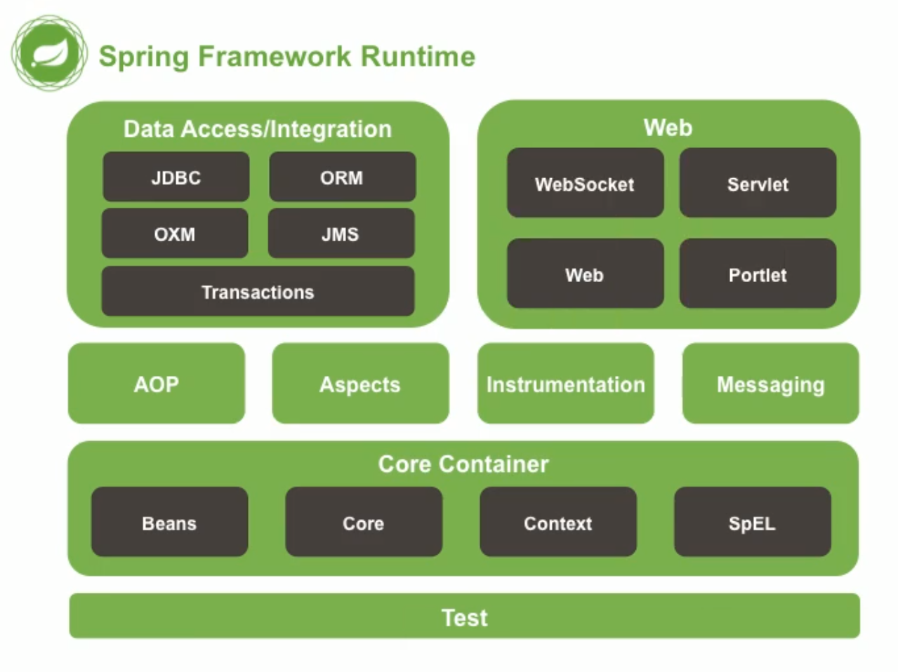

# Spring


## 1 初识Spring

### 框架

> `SSM框架`
>
> Spring+SpringMVC+MyBatis

> `什么叫框架`
>
> 高度抽取可重用代码的一种设计
>
> 具有高度的通用性
>
> 多个可重用模块的集合，形成一个某领域整体解决方案


### Spring

> Spring是一个`容器`框架
>
> 可以管理所有组件（类）

> Spring最重要的两个核心是`IOC`和`AOP`

> Spring的优点
>
> 非侵入式：不依赖于API，可以完全不懂，即可上手使用
>
> 依赖注入：IOC最经典的实现
>
> 面向切面编程：AOP
>
> 容器：Spring是一个容器，它包含并管理着对象的生命周期
>
> 组件化：实现了简单组件配置组合，使用部分功能不需要全部导入依赖
>
> 一站式：整合了各种企业应用开原框架



> Spring的模块划分图
>
> `Test`是Spring单元测试模块
>
> `Core Container` Spring的核心容器（IOC），黑色部分代表由哪些Jar包组成，要使用这部分的完整功能，需要导入全部Jar包
>
> `AOP`+`Aspects`：AOP是面向切面编程，Aspects是切面。他们俩共同组成面向切面编程
>
> `Instrumentation`+`Messaging`：不作了解
>
> `Data Access`：数据访问模块
>
> **JDBC** 负责操作数据库
>
> **ORM**（Objective Relation Mapping）对象关系映射
>
> **Transactions **简写为tx，控制事务的模块
>
> OXM x代表xml，对象与xml映射，不需要了解
>
> JMS java spring消息服务，不需要了解
>
> `Web`：Spring开发Web应用的模块
>
> WebSocket websocket技术
>
> servlet 和原生web相关的模块，jar包名为web
>
> web 开发web项目模块，jar包名为webmvc
>
> portlet 开发web应用组件的集成
>
> 
>
> 用哪个模块导哪个包


## 2 IOC初识

> Spring两个重要的功能就是`IOC（容器）`和`AOP（面向切面的编程）`

> IOC（ Inversion Of Control） : 控制反转
>
> 资源的获取方式分为主动式和被动式

主动式：需要的资源需要手动创建

```java
BookServlet{
    BookService bs = new BookService();
}
```

被动式：资源的获取不是我们来创建，而是交给容器来创建

```java
BookServlet{
    BookService bs;
    public void test(){
        bs.checkout();
    }
}
```


### 容器

> 容器管理所有的组件
>
> 容器可以自动的探查出，哪些组件需要另一些组件
>
> 容器帮我们创建BookService对象，并且帮我们赋值
>
> 将我们主动new资源变为被动的接受资源

> 容器类似于婚介所
>
> 在婚介所注册后，告诉婚介所需要什么样的对象，婚介所会给你匹配合适的对象


### DI

> DI : Dependency Injection 依赖注入
>
> IOC是一种思想，DI是一种实现IOC的方式
>
> 容器能知道，哪个组件运行的时候，需要另一个组件
>
> 容器通过反射的形式，将容器中准备好的对象，注入给需要的对象

> 只要是容器管理的组件，都能使用容器提供的功能


### HelloWorld

> 通过各种方式给容器中注册对象

```xml
<bean id="person01" class="com.augus.bean.Person">
		<property name="name" value="张三"></property>
		<property name="age" value="20"></property>
</bean>
```

> 首先编写Spring配置文件
>
> 每一个bean就是在Spring中注册的对象

```java
package com.augus.bean;

public class Person {
	private String name;
	private Integer age;
	
	public Person() {
		super();
	}

	public Person(String name, Integer age) {
		super();
		this.name = name;
		this.age = age;
	}

	public String getName() {
		return name;
	}

	public void setName(String name) {
		this.name = name;
	}

	public Integer getAge() {
		return age;
	}

	public void setAge(Integer age) {
		this.age = age;
	}

	@Override
	public String toString() {
		return "Person [name=" + name + ", age=" + age + "]";
	}
	
}
```

> 这是一个很简单的Person类，并把它注册到Spring容器中，并赋值

```java
public void test01() {
    ApplicationContext ioc = new ClassPathXmlApplicationContext("SpringConfig.xml");
    Person person = (Person) ioc.getBean("person01");
    System.out.println(person);
}

//输出结果为
//Person [name=张三, age=20]
```

> 然后我们写一个简单的测试，发现我们并没有new Person的对象，但是可以进行正常的输出
>
> 1. ClassPathXml就是我们之前写的Spring配置文件，简单来说就是婚介所的记录表你放在哪里了。也可以用别的类，它的实现类总共只有两个。其中一个是FileSystem就是在磁盘中寻找配置文件，一般我们还是使用ClassPath
>
> 2. ioc就像替我们保管的容器，我们调用它的getBean方法，并且传入参数为我们刚才在Spring配置文件中所填对象的id值，来获取到在Spring中注册的那个对象


### HelloWorld中存在的细节

> 1. Person是什么时候被创建的
>
>    我们修改一下Person的构造方法，再修改一下测试类

```java
public Person() {
    super();
    System.out.println("Person被创建了");
}
```

```java
public void test01() {
    ApplicationContext ioc = new ClassPathXmlApplicationContext("SpringConfig.xml");
    
}

//Person被创建了
```

> `结论`
>
> ioc容器加载时，就已经创建了Person对象，无论我们是否使用他（饿汉式）


----


> 2. 先看代码

```java
public void test01() {
    ApplicationContext ioc = new ClassPathXmlApplicationContext("SpringConfig.xml");
    Person person = (Person) ioc.getBean("person01");
    Person person2 = (Person) ioc.getBean("person01");
    System.out.println(person2 == person);
}

//true
```

> `结论`
>
> 同一个组件在容器中是`单实例`的


----


> 3. 如果我们在set方法中输出一句话，会发现该方法在容器创建时也会在控制台输出
>
> `结论`
>
> 容器在创建对象的时候，会使用Set方法为bean的属性进行赋值


----


> 4. bean的属性名是由set方法来决定的，属性名就是set后面的字母，并且首字母改小写
>
>    如果我们更改set方法的名，比如将setName改为setLastname，就会报错
>
> `结论`
>
> bean的属性名是由set方法来决定的
>
> 我们尽量使用系统生成get/set方法，避免手写


## 3 IOC深入探究

### 3.1 根据类型获取实例 **（重点）**

```xml
public void test02() {
    Person person = ioc.getBean(Person.class);
    System.out.println(person);
}
```

> 这个很容易，看一下就了解了

> 如果我们在容器中注册了两个Person则会报错
>
> 如果有多个，则只能通过id来找
>
> 或者既通过类型，又通过id来找

```java
public void test02() {
    Person person = ioc.getBean("person02",Person.class);
    System.out.println(person);
}
```


### 3.2 通过构造器赋值

```java
public Person(String name, Integer age) {
    super();
    this.name = name;
    this.age = age;
}
```

> 首先你的类中要有有参构造器

```xml
<bean id="person02" class="com.augus.bean.Person">
    <constructor-arg name="name" value="李四"></constructor-arg>
    <constructor-arg name="age" value="30"></constructor-arg>
</bean>
```

```java
Person person = ioc.getBean("person02",Person.class);
System.out.println(person);
```

> 使用 <constructor-arg>标签，使用构造器为对象赋值
>
> 构造函数有多少个参数，就需要写多少个<constructor-arg>不然会报错


---


```xml
<bean id="person03" class="com.augus.bean.Person">
    <constructor-arg value="王五"></constructor-arg>
    <constructor-arg value="40"></constructor-arg>
</bean>
```

> 你也可以不写name属性，直接写value值，但顺序必须与构造器相同


```xml
<bean id="person03" class="com.augus.bean.Person">
    <constructor-arg value="123@qq.com"></constructor-arg>
    <constructor-arg value="40"></constructor-arg>
    <constructor-arg value="王五"></constructor-arg>
</bean>

<!--Person [name=123@qq.com, age=40, email=王五] -->
```

> 如果我们添加一个同样是String类型的参数，并将顺序颠倒赋值，结果就被赋给了错误的值
>
> 如何解决这种问题呢？

```xml
<bean id="person03" class="com.augus.bean.Person">
    <constructor-arg value="123@qq.com" index="2"></constructor-arg>
    <constructor-arg value="40"></constructor-arg>
    <constructor-arg value="王五" index="0"></constructor-arg>
</bean>

<!--Person [name=王五, age=40, email=123@qq.com] -->
```

> 为属性加上index属性，就可以解决不写name，顺序错误问题（虽然没什么用）

> 如果我们让构造函数重载，会发生什么呢

```java
public Person(String name, Integer age) {
    super();
    this.name = name;
    this.age = age;
}

public Person(String name, String email) {
    super();
    this.name = name;
    this.email = email;
}
```

```xml
<bean id="person05" class="com.augus.bean.Person">
    <constructor-arg value="王五"></constructor-arg>
    <constructor-arg value="40"></constructor-arg>
</bean>

<!--Person [name=王五, age=null, email=40] -->
```

> 如何解决这个问题呢
>
> 我们需要另一个属性，type

```xml
<bean id="person05" class="com.augus.bean.Person">
    <constructor-arg value="王五"></constructor-arg>
    <constructor-arg value="40" index="1" type="java.lang.Integer"></constructor-arg>
</bean>

<!--Person [name=王五, age=40, email=null]-->
```


### 3.3 通过p名称空间赋值

```xml
<bean id="person06" class="com.augus.bean.Person" p:name="小花" p:age="20" p:email="123@qq.com">
</bean>
```

> 也可以这样写，但这样写有点乱，太长了，不推荐


### 3.4 为各种类型属性赋值

> 我们在Person类中新增了各种类型的属性

```java
private String name;
private Integer age;
private String email;
private Car car;
private List<Book> books;
private Map<String,Object> maps;
private Properties properties;
```

#### 3.4.1 使用null赋值

```java
private String name = "张三";
private Integer age;
private String email;
private Car car;
private List<Book> books;
private Map<String,Object> maps;
private Properties properties;
```

> 如果我们想把name赋值为null

```java
<bean id="person01" class="com.augus.bean.Person">
    <property name="name"><null/></property>
</bean>
```

> 在属性标签中加入<null>标签


#### 3.4.2 引用赋值

```xml
<bean id="person01" class="com.augus.bean.Person">
    <property name="car" ref="car01"></property>
</bean>

<bean id="car01" class="com.augus.bean.Car">
    <property name="carName" value="宝马"></property>
    <property name="color" value="蓝色"></property>
    <property name="price" value="300000"></property>
</bean>
```

> 使用 ref 引用另一个已注册的 bean 的 id

```xml
<bean id="person01" class="com.augus.bean.Person">
    <property name="car">
        <bean class="com.augus.bean.Car">
            <property name="carName" value="奔驰"></property>
            <property name="color" value="黑色"></property>
            <property name="price" value="400000"></property>
        </bean>
    </property>
</bean>
```

> 或者可以直接在属性内部，嵌套一个<bean>标签


#### 3.4.3 List赋值

```xml
<bean id="person02" class="com.augus.bean.Person">
    <property name="books">
        <list>
            <bean class="com.augus.bean.Book" p:bookName="西游记"></bean>
            <ref bean="book01"/>
        </list>
    </property>
</bean>

<bean id="book01" class="com.augus.bean.Book">
    <property name="bookName" value="三国演义"></property>
</bean>
```

> list赋值写在<list>标签里
>
> 与引用类型赋值相同，可以使用内部bean或者引用外部bean


#### 3.4.4 map赋值

```xml
<bean id="person02" class="com.augus.bean.Person">
    <property name="maps">
        <map>
            <entry key="key01" value="value01"></entry>
            <entry key="key02" value-ref="book01"></entry>
            <entry key="key03">
                <bean class="com.augus.bean.Car">
                    <property name="carName" value="奔驰"></property>
                    <property name="color" value="黑色"></property>
                    <property name="price" value="400000"></property>
                </bean>
            </entry>
            <entry key="key04">
                <map></map>
            </entry>
        </map>
    </property>
</bean>
```

> map赋值与list基本相同，也是写在<map>标签中


#### 3.4.5 Properties赋值

```xml
<bean id="person03" class="com.augus.bean.Person">
    <property name="properties">
        <props>
            <prop key="username">root</prop>
            <prop key="password">1234</prop>
        </props>
    </property>
</bean>
```

> Properties赋值与之前没有什么区别，要注意的是<prop>标签中没有value属性，只能写在两个标签包含的内部


#### 3.4.6 Util名称空间

```xml
<bean id="person04" class="com.augus.bean.Person">
    <property name="maps" ref="map01"></property>
</bean>

<util:map id="map01">
    <entry key="key01" value="value01"></entry>
    <entry key="key02" value-ref="book01"></entry>
    <entry key="key03">
        <bean class="com.augus.bean.Car">
            <property name="carName" value="奔驰"></property>
            <property name="color" value="黑色"></property>
            <property name="price" value="400000"></property>
        </bean>
    </entry>
    <entry key="key04">
        <map></map>
    </entry>
</util:map>
```

> 如果一个集合想被别的bean引用，需要使用util名称空间


#### 3.4.7 级联属性赋值

```xml
<bean id="person05" class="com.augus.bean.Person">
    <property name="car" ref="car01"></property>
    <property name="car.price" value="200"></property>
</bean>

<bean id="car01" class="com.augus.bean.Car">
    <property name="carName" value="奔驰"></property>
    <property name="color" value="黑色"></property>
    <property name="price" value="400000"></property>
</bean>
```

> 引用外部的bean之后，还可以更改其值，直接使用"."即可


### 3.5 bean之间的继承

```xml
<bean id="person06" class="com.augus.bean.Person">
    <property name="name" value="张三"></property>
    <property name="age" value="18"></property>
    <property name="email" value="12@qq.com"></property>
</bean>

<bean id="person07" class="com.augus.bean.Person" parent="person06" >
    <property name="name" value="李四"></property>
</bean>
```

> 如果多个值相同，可以直接继承，并修改其中部分的值
>
> 可以省略class，但不推荐


### 3.6 抽象bean

```xml
<bean id="person06" class="com.augus.bean.Person" abstract="true">
    <property name="name" value="张三"></property>
    <property name="age" value="18"></property>
    <property name="email" value="12@qq.com"></property>
</bean>
```

> 加入 abstract="true" 就可以生命为抽象bean，该对象不可被获取，只可以被其他bean继承


### 3.7 bean之间的依赖

```xml
<bean id="person01" class="com.augus.bean.Person"></bean>
<bean id="car01" class="com.augus.bean.Car"></bean>
<bean id="book01" class="com.augus.bean.Book"></bean>
```

> 这三个对象的创建顺序是从上而下的

```xml
<bean id="person01" class="com.augus.bean.Person" depends-on="car01,book01"></bean>
<bean id="car01" class="com.augus.bean.Car"></bean>
<bean id="book01" class="com.augus.bean.Book"></bean>
```

> 使用depends-on可以改变创建顺序，只是改变了创建顺序


### 3.8 bean的作用域，单实例与多实例**（重点）**

> bean默认是单实例的

```xml
<bean id="book01" class="com.augus.bean.Book" scope="prototype"></bean>
```

> 创建bean的时候，有一个属性叫scope，它有四个选项
>
> `prototype`：多实例
>
> `singleton`：单实例 **默认值**
>
> `request`：在Web环境下，同一次请求创建一次**（没用）**
>
> `session`：在Web环境下，同一次会话创建一次**（没用）**

> 单实例的bean，在容器启动时就已经创建了
>
> 多实例的bean，在使用的时候才会被创建，每次都会创建一个新的对象


### 3.9 通过工厂来创建bean**（重点）**

> bean的创建默认就是框架利用反射new出来的

```java
public class Airplane {
	private String engine;
	private String wingLength;
	private String busload;
	private String captainName;
}
```

> 如果有这样一个类，每次创建对象，除了机长名其余属性都一样
>
> 虽然可以使用之前继承的方法来实现，但还是太麻烦

> 我们可以使用工厂模式，工厂帮我们创造对象，我们只需要给它机长的名字，自动会得到我们想要的对象
>
> 专门有一个类帮我们创造对象，这个类就是工厂类

> 工厂类分为两种：
>
> `静态工厂`：工厂本身不用创建对象，通过静态方法调用  
>
> `实例工厂`：工厂本身需要创建对象


#### 静态工厂

```xml
<bean id="airplane01" class="com.augus.bean.StaticFactory" 
      factory-method="getAirplane">
    <constructor-arg value="张三"></constructor-arg>
</bean>
```

> 在飞机bean标签中
>
> `class`指定工厂的全路径名
>
> `factory-method`指定工厂方法
>
> 如果方法需要参数使用<constructor-arg> 为方法传递参数


#### 实例工厂

```xml
<bean id="airplaneFactory" class="com.augus.bean.InstanceFactory"></bean>

<bean id="airplane02" class="com.augus.bean.Airplane" 
      factory-bean="airplaneFactory" factory-method="getAirplane">
    <constructor-arg value="张三"></constructor-arg>
</bean>
```

> 在飞机bean标签中
>
> ` factory-bean`指定工厂的bean
>
> 剩下的与静态工厂一样


#### FactoryBean

> FactoryBean是Spring定义的工厂类接口

```java
public class MyFactoryBean implements FactoryBean<Book>{
	@Override
	public Book getObject() throws Exception {
		Book book = new Book();
		book.setBookName("这是书名");
		return book;
	}
	@Override
	public Class<?> getObjectType() {
		return Book.class;
	}
}
```

```xml
<bean id="myFactory" class="com.augus.bean.MyFactoryBean"></bean>
```

> 如果我们自己写一个方法实现了FactoryBean，并且将它注册到容器中
>
> 我们获取myFactory，会得到一个Book的对象
>
> 因为实现了FactoryBean的对象，Spring会认为它就是一个工厂类
>
> **注意**  此方法并不会在容器启动时创建实例，不论是否是单实例


### 3.10 bean的生命周期

> 我们在Book类中添加两个方法

```java
public void myInit() {
    System.out.println("这是Book的初始化方法...");
}

public void myDestory() {
    System.out.println("这是Book的销毁方法...");
}
```

```xml
<bean id="book01" class="Book" destroy-method="myDestory" init-method="myInit"></bean>
```

> 在bean标签中可以指定初始化方法和销毁方法

> bean的生命周期是
>
> （容器创建）构造器-------->初始化方法-------->（容器关闭）销毁方法
>
> 多实例的时候，在获取bean的时候才会创建对象，容器关闭不会调用销毁方法


### 3.11 bean的后置处理器


## 4 AOP

> 声明式事务


